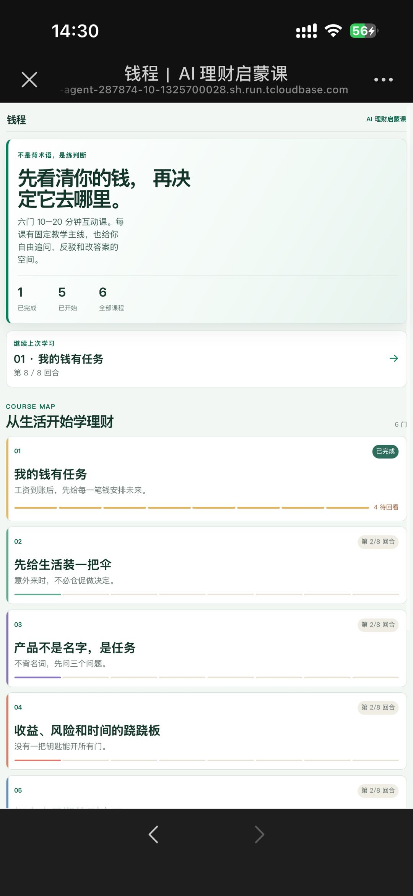
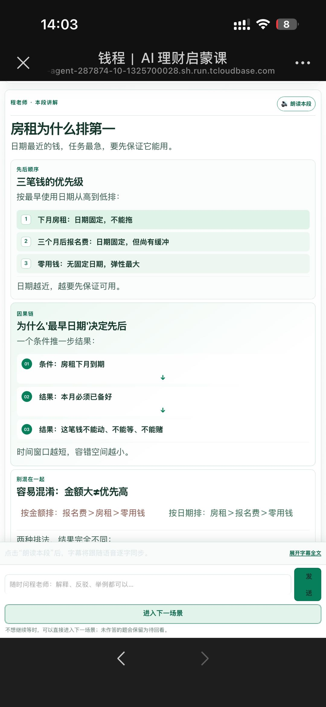
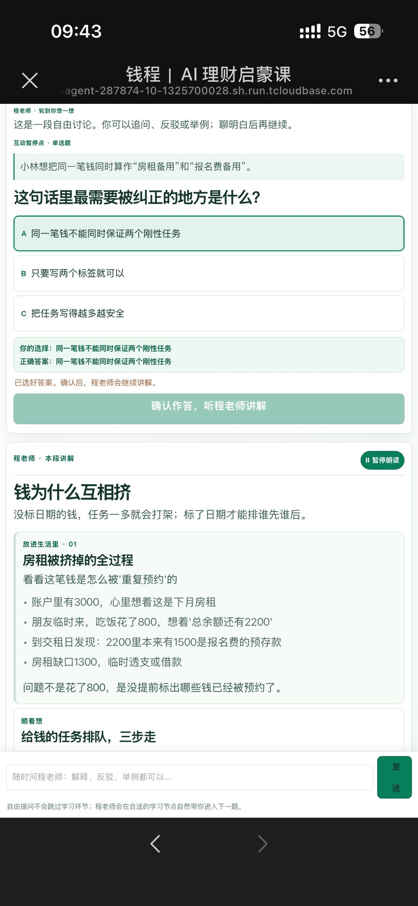
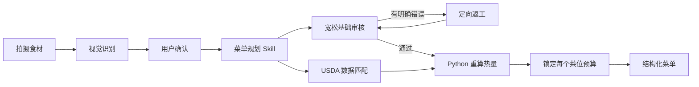
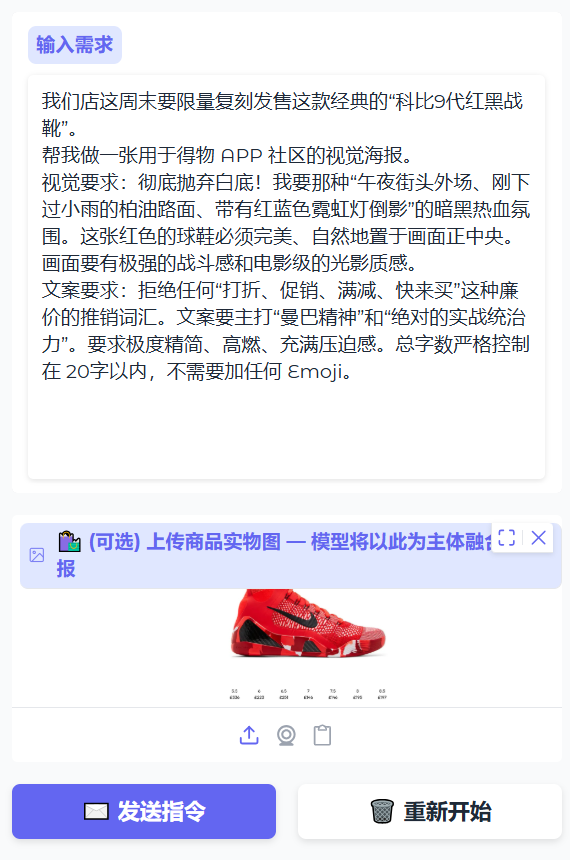
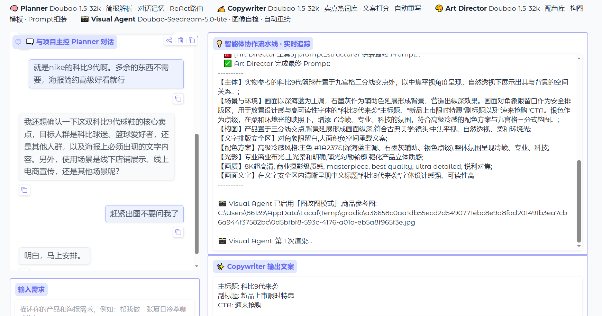
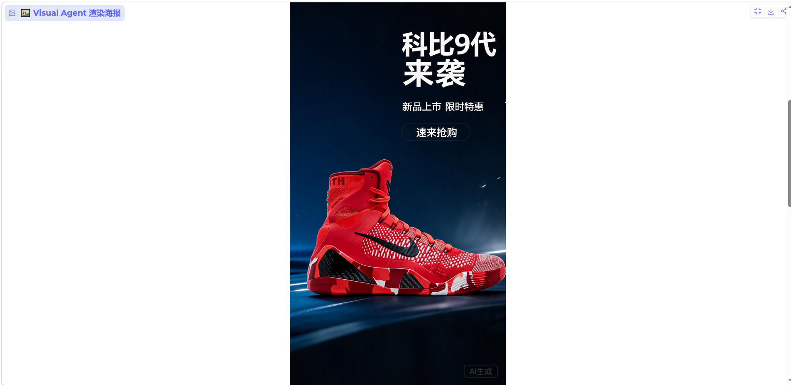
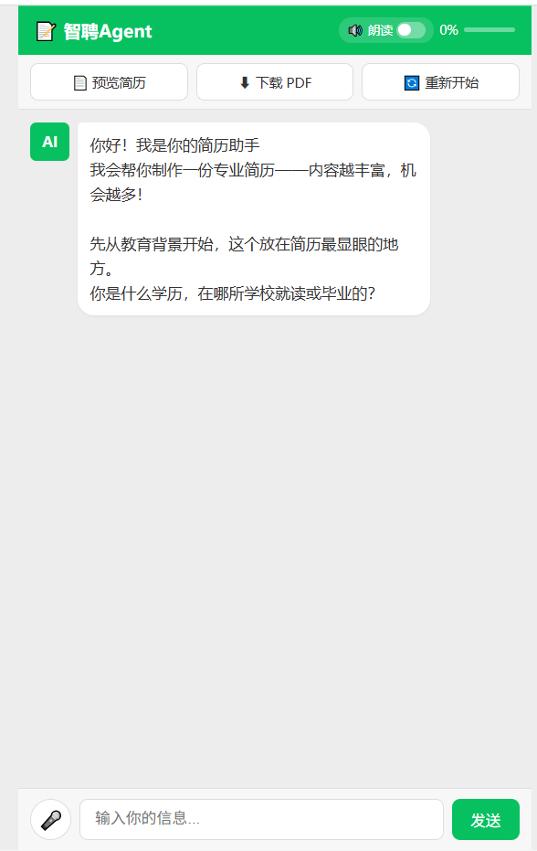
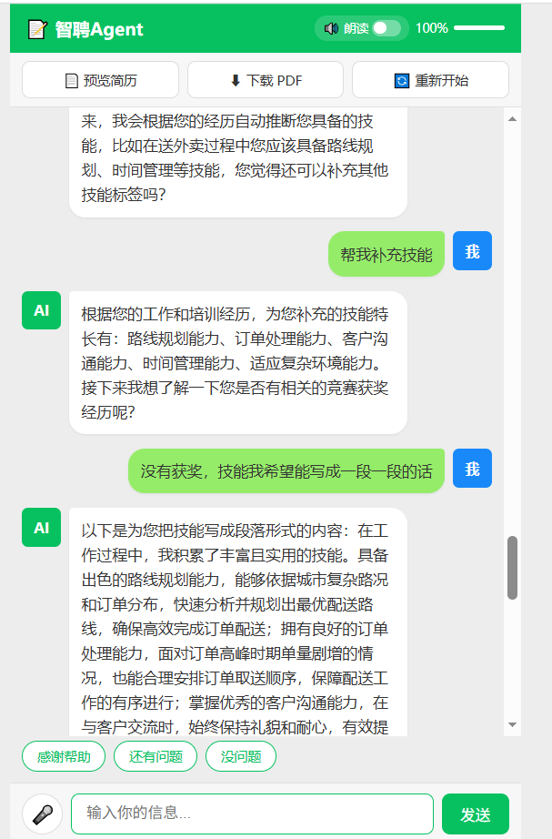
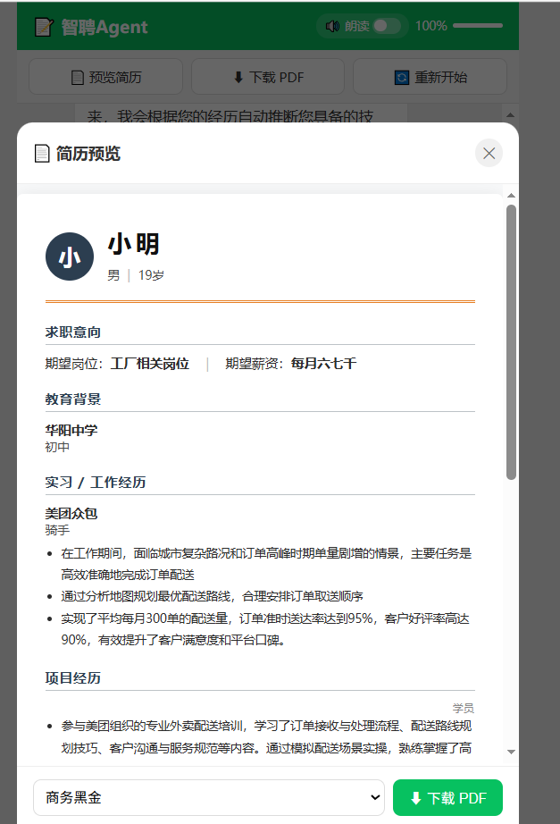

# Vibe Coding 作品集

> 这是一个包含多个不同 Vibe Coding 作品的个人作品集仓库，记录我如何把产品洞察、AI 工作流设计和工程实现组合成可以运行、验证和复盘的原型。

当前仓库包含：

- 2 个完整前后端 AI 应用；
- 1 个可复用 AI 产品经理教学 Skill；
- 2 个保留完整实现过程的 Notebook 原型。

五个作品面向不同用户、问题和产品形态，成熟度也不相同。我会分别用源码、交互截图、测试、质量检查脚本和明确的局限说明它们当前做到了什么，而不是把所有原型包装成已经完成商业验证的产品。

## 项目导航

| 作品 | 形态 | 解决的问题 | 核心实现 | 当前证据 |
| --- | --- | --- | --- | --- |
| [钱程｜理财知识启蒙学习Agent](钱程AI理财课堂/) | FastAPI + React H5 完整工程原型 | 帮助理财初学者把抽象概念放回日常决策 | AI 老师讲解、情境选择、可视化教学卡、课程进度、语音朗读与 CloudBase 部署 | [在线体验](https://qiancheng-ai-finance-agent-287874-10-1325700028.sh.run.tcloudbase.com/#/pages/index/index)、源码、Dockerfile、移动端截图、前后端测试 |
| [圆头耄耋智能配菜 Agent](圆头耄耋智能配菜Agent/) | FastAPI + Next.js 完整工程原型 | 根据现有食材规划相对低热量菜单，并支持受约束换菜 | 图片识别、结构化菜单、USDA 热量重算、审核返工、固定菜位预算、全局换菜忙锁 | 脱敏源码、Dockerfile、6 张实机截图、前后端测试 |
| [AI 产品经理课程老师 Skill](Skills作品/aipm-course-teacher/) | 可复用 Codex Skill | 把零散的 AI PM 学习变成课程、教学、练习和归档流程 | 课程注册、来源门槛、章节检索、对话式教学、小测、学习状态管理 | `SKILL.md`、9 个脚本、Harness 课件、质量检查脚本 |
| [AIGC 电商海报及文案制作 Agent](AIGC电商海报及文案制作Agent.ipynb) | Jupyter + Gradio Notebook 原型 | 从自然语言需求和可选商品图生成文案与海报草案 | Planner、Copywriter、Art Director、Visual 四段角色化流水线 | 完整 Notebook、保存的运行输出、3 张交互与结果截图 |
| [智聘 Agent · AI 智能简历](AI智能简历.ipynb) | Flask + 单页 HTML Notebook 原型 | 通过对话帮助不熟悉简历写作的求职者整理经历 | 逐步采集、AI 辅助改写、结构化快照、完成度计算、简历预览 | 完整 Notebook、3 张交互截图 |

## 我想展示的不是“会调 API”，而是完整闭环

这组作品覆盖了五种不同的 Vibe Coding 任务：

1. **做一个完整 AI Web 产品**：从移动端交互、异步任务到部署与成本复盘。
2. **把抽象知识做成互动课堂**：让 AI 在明确课程主线中讲解、追问和反馈。
3. **把专业工作流封装成 Skill**：让教学、资料标准和状态管理可重复执行。
4. **用多阶段 Agent 生成内容**：拆开需求、文案、视觉决策和图像生成。
5. **用对话替代表单**：把用户的自然表达逐步转成结构化结果。

不同任务采用了不同技术，但共用一条原则：

> 让模型负责识别、规划和语言，让确定性代码负责数据、计算、状态、权限和失败边界。

## 能力矩阵

| 能力 | 仓库里的具体实现 | 可以检查的证据 |
| --- | --- | --- |
| 产品问题拆解 | 将“现有食材怎么吃”“抽象理财怎么学”“AI PM 学习状态丢失”“电商图文流程割裂”“不会写简历”拆成五种产品流程 | 五个项目的问题定义、用户旅程和边界说明 |
| 用户交互设计 | 拍照—校正—生成—换菜—做菜；情境课堂—选择—追问—续学；对话式简历采集；Gradio 海报流水线 | 两个 Web 工程、两个 Notebook 和产品截图 |
| Agent / Skill 编排 | 菜单生成与审核 Skills、AI 老师的课程响应契约、课程老师 Skill、海报四阶段流水线 | 两个 Web 工程的后端、`Skills作品/aipm-course-teacher/SKILL.md`、AIGC Notebook |
| 结构化输出约束 | Pydantic、JSON Schema、Zod、课程卡片与选择题契约、结构化简历快照、简报解析 | 两个 Web 工程的 contracts/models、两个 Notebook |
| LLM 与代码分工 | LLM 负责视觉识别、菜单规划、教学讲解和语言生成；代码负责热量、课程状态、预算、完成度、锁和版本 | 两个 Web 工程的后端、课程质量脚本、Notebook 评分函数 |
| 失败与返工设计 | 菜单审核返工、换菜三次审核、文案低分重写、图像基础质检重绘 | `圆头耄耋智能配菜Agent/backend/app/agent.py`、`圆头耄耋智能配菜Agent/backend/app/channels.py`、AIGC Notebook |
| 数据与事实来源 | USDA 本地知识库和营养来源链接；课程资料来源门槛 | `圆头耄耋智能配菜Agent/backend/data/nutrition.db`、`圆头耄耋智能配菜Agent/backend/app/nutrition.py`、课程 `references/` |
| 工程实现 | FastAPI、Next.js、React、Flask、Gradio、SQLite、Docker | 圆头耄耋完整工程和两个 Notebook |
| 测试与验证 | 后端规则与接口测试、前端交互测试、课程质量检查脚本 | `圆头耄耋智能配菜Agent/backend/tests/`、`圆头耄耋智能配菜Agent/frontend/tests/`、`Skills作品/aipm-course-teacher/scripts/check_course_quality.py` |
| 部署与成本意识 | Docker 多阶段构建、CloudBase 配置、缩容和资源计费复盘 | `圆头耄耋智能配菜Agent/Dockerfile`、项目 README 的部署与取舍章节 |

---

# 作品一：钱程｜理财知识启蒙学习Agent

> 面向理财初学者的互动式 AI 课堂。它不提供投资建议，而是让学生在工资到账、房租、临时支出、产品推荐等具体场景里，练习判断一笔钱该如何安排。

[在线体验 →](https://qiancheng-ai-finance-agent-287874-10-1325700028.sh.run.tcloudbase.com/#/pages/index/index) · [查看完整项目说明、架构与测试 →](钱程AI理财课堂/)

> 体验服务采用按需启动。首次打开若暂未加载，请等待 **30–60 秒**，再退出并重新打开链接；服务唤醒后可正常进入课程。

## 为什么做这个项目

理财内容常常把“应当储蓄、不要冲动消费、要分散风险”讲成结论，但结论并不能帮助一个初学者处理当下的真实冲突：下月房租、三个月后的报名费和今天看起来仍然充足的余额，到底谁该排在前面？

钱程把这类问题做成固定学习主线中的互动场景。学生不是被动看一篇文章，也不是直接面对无边界的聊天机器人；而是在老师引导下作出选择、说明理由、追问反例，再从反馈中理解判断顺序。课程先覆盖现金流、生活缓冲、期限与流动性、风险、目标和反诈，再进入基金与股票的底层资产、净值与波动判断；全程不输出具体金融产品推荐或买卖指令。

## 产品截图

<table>
  <tr>
    <td align="center"><br><b>从课程地图开始</b><br>查看八门课、学习进度与可继续的回合</td>
    <td align="center"><br><b>把判断过程画出来</b><br>用优先级、因果链和对比卡解释理财概念</td>
    <td align="center"><br><b>选择后继续上课</b><br>老师围绕学生答案讲解，而不是只显示对错</td>
  </tr>
</table>

## 互动课堂的设计

| 学习时刻 | 学生可以做什么 | 系统如何回应 | 设计目的 |
| --- | --- | --- | --- |
| 进入课程 | 从上次进度继续，或从头学习 | 恢复单课状态、展示当前场景 | 不让退出打断学习主线 |
| 老师讲解 | 阅读讲解、播放语音、提出追问 | 根据当前课件和对话上下文继续教学 | 让自由讨论仍然围绕当前知识点 |
| 看到选择题 | 选择答案，也可暂不回答 | 答案确认后标记“你的选择”和唯一正确答案 | 把判断依据说清，而不只给结论 |
| 回答后 | 听老师讲解或继续追问 | AI 根据实际选择生成针对性反馈，并补充可视化要点 | 让同一题的不同选择得到不同解释 |
| 不想等待 | 点击“进入下一场景” | 保留未答题目，直接推进到下一段学习 | 用户保持节奏控制权 |
| 课程收尾 | 继续自由提问 | 老师明确说明本课已讲完，欢迎继续问不懂的地方 | 课程结束不等于对话结束 |

## 实现上的关键分工

- **AI 老师 / Kimi**：依据当前课程、场景、学生选择和最近对话生成讲解、追问与卡片内容；结课时将“课程讲完、可继续提问”的话写进实际讲解和语音内容。
- **结构化课件与响应契约**：限定课程主线、选择题、唯一正确答案、卡片类型和允许引用的内容，避免模型临场编造教学事实。
- **FastAPI 服务**：保存单课进度与互动轮次，处理模型调用超时、取消与语音合成，并把 H5 页面和 API 同源部署。
- **React / Taro 前端**：展示课程地图、教学内容、字幕、固定输入栏和语音播放；在移动与桌面宽度下重排布局，而不是按比例缩小整个页面。
- **CloudBase 容器部署**：Docker 两阶段构建前端静态资源与后端服务，GitHub `main` 分支推送后触发部署。

## 当前边界

- 这是金融素养教育产品，不提供个性化投资建议、买卖指令、仓位或收益承诺。
- 模型调用受网络和上游响应时间影响；前端在超时后提示“LLM 思考超时，请重试”，不会把迟到结果插入已结束的交互。
- 云端实例会按需启动，首次打开需要等待冷启动；这是当前演示环境的成本取舍。
- 当前以单用户、单浏览器学习状态为主，尚未建设账号体系和跨设备同步。

---

# 作品二：圆头耄耋智能配菜 Agent

> 拍下现有食材，经用户确认后，生成适合人数、餐数、厨具和忌口条件的低热量菜单；热量优先使用 USDA FoodData Central 数据按实际克数重算。

[查看完整项目说明、架构、接口、测试与部署方法 →](圆头耄耋智能配菜Agent/)

## 为什么做这个项目

菜谱搜索默认用户已经知道自己想吃什么，但现实往往是“冰箱里有一堆东西，却不知道怎么组合”。与此同时，“AI 低卡推荐”如果只靠模型报数字，用户无法判断热量来源是否可信。

我把问题拆成三个部分：

1. **减少库存录入**：先拍照识别，再由用户修改名称和估算克数。
2. **分离创意与事实**：模型设计菜品，USDA 提供每 100g 数据，Python 负责最终计算。
3. **控制换菜副作用**：每个菜位保存初次分配的固定食材预算，换菜不侵占其他菜位。

## 产品流程

<table>
  <tr>
    <td align="center"><br><b>拍摄食材</b><br>从照片开始，而不是从搜索框开始</td>
    <td align="center"><br><b>生成菜单</b><br>按人数、餐数和菜位组织结果</td>
    <td align="center"><br><b>过程可见</b><br>展示规划、固定预算和营养回填</td>
  </tr>
  <tr>
    <td align="center"><br><b>防止并发换菜</b><br>第二次点击不发送、不排队</td>
    <td align="center"><br><b>营养可追溯</b><br>逐项展示克数、热量和 FDC 来源</td>
    <td align="center"><br><b>进入厨房执行</b><br>用逐步模式把推荐变成行动</td>
  </tr>
</table>

## 核心工作流



### Agent、Skill、数据和代码怎么分工

- **Kimi / Moonshot API**：负责图片理解、菜单草稿、审核和定向修复。
- **业务 Skills**：分别定义视觉盘点、菜单规划、最低合格审核和单菜位换菜规则。
- **Pydantic / Zod**：限制模型输出和前后端交互的数据结构。
- **USDA SQLite**：内置 Foundation Foods 与 SR Legacy，共 7,888 条营养记录。
- **Python**：按克数重算热量，处理库存、版本、幂等、任务和替换状态。
- **React 状态机**：负责用户流程、忙碌弹窗、失败重试和本地恢复。

USDA 检索由 Python 营养解析器直接执行，并不是让模型自主选择或调用 Tool。这个边界是刻意设计的：事实检索和数值计算不应该依赖模型临场发挥。

## 换菜不是“再问模型一次”

换菜是一条独立的状态机：

- 当前菜在整个换菜过程中保持显示。
- 每次只允许一个全局换菜任务。
- 第二次点击只弹出“耄耋哈气了”，不发送请求、不加入队列。
- 关闭弹窗不会取消后台正在进行的任务。
- 每个菜位始终使用初次分配的固定食材预算。
- 候选菜最多审核 3 次、定向返工 2 次。
- 审核通过并完成热量回填后，才在内存中一次性替换当前菜。
- 第三次仍不通过时保留原菜、释放忙锁，并允许用户“再换一次”。

这里的“原子替换”指单进程内成功后的一次内存赋值，不是数据库事务或分布式提交。

## 技术栈

`Python 3.12` · `FastAPI` · `Pydantic 2` · `HTTPX` · `SQLite / FTS5` · `Next.js 16` · `React 19` · `TypeScript` · `Zod 4` · `unittest` · `Vitest` · `Docker`

## 当前边界

这是仓库中工程完整度最高的作品，但仍是单实例原型：

- 菜单、Job、幂等记录和换菜锁保存在进程内存中。
- 服务重启或缩容后，旧菜单和任务可能失效。
- 多个容器实例会分别拥有自己的锁，不能直接横向扩容。
- 图片重量和食材可食部仍然是估算。
- 营养信息用于产品演示和日常参考，不能替代医疗或专业营养建议。

---

# 作品三：AI 产品经理课程老师 Skill

> 一个把选课、课程生成、对话式教学、练习、面试训练和学习状态归档组织成固定流程的可复用 Skill。

[查看 Skill 说明 →](Skills作品/aipm-course-teacher/)

## 这个项目在解决什么问题

AI 产品经理学习材料通常来自官方文档、论文、GitHub 项目和工程文章。如果只让通用模型“讲一课”，容易出现三个问题：

- 课程内容浅，缺少来源；
- 每次上课重新开始，没有学习状态；
- 讲完没有练习、面试表达和项目转化。

这个项目不依赖一个超长 Prompt，而是把教学拆成可维护的 Skill、SOP、课程文件、脚本和状态目录。

## 目录职责

```text
Skills作品/aipm-course-teacher/
├── SKILL.md                         # 触发规则与教学主流程
├── README.md                        # 安装、能力和维护说明
├── references/
│   ├── course_authoring_sop.md      # 新课写作规范
│   ├── teaching_sop.md              # 对话式授课规范
│   ├── interview_rubric.md          # 面试回答评价
│   ├── project_path.md              # 从课程到项目的路径
│   └── courses/harness/             # 当前注册课程
├── scripts/
│   ├── list_courses.py
│   ├── add_course.py
│   ├── check_course_quality.py
│   ├── extract_course_section.py
│   ├── generate_quiz.py
│   ├── resolve_course.py
│   ├── state_manager.py
│   ├── archive_lesson.py
│   └── export_daily_summary.py
└── state/
```

当前注册课程是 Harness。质量脚本会检查课程体量、章节、来源链接、权威域名和 GitHub 项目数量。它提供的是可重复执行的内容门槛，不等同于对每个来源进行人工学术背书。

## 我在这个项目里的产品判断

- “AI 老师”不只是回答问题，还要管理课程、状态、练习和产出。
- 资料可信度需要可执行门槛，不能只在 Prompt 里要求“请权威”。
- 正式上课应该短讲、提问、纠偏，再继续，而不是一次输出整章。
- 学习结果应该能转化为面试表达和可展示项目。

---

# 作品四：AIGC 电商海报及文案制作 Agent

> 一个把自然语言需求拆成简报、文案、视觉决策和图像生成四段流程的 Notebook 原型。

[查看完整 Notebook →](AIGC电商海报及文案制作Agent.ipynb)

## 产品假设

小型商家和内容创作者经常需要同时处理卖点提炼、文案、配色、构图和出图。单次端到端生成虽然快，但需求容易丢失，也难判断是哪一步出了问题。

这个原型模拟一个精简广告团队，把流程拆成：

1. **Planner**：把自然语言需求整理成结构化简报。
2. **Copywriter**：从 5 类品类词库和 1 个通用兜底库取材，生成并评分文案；低于门槛时自动重写一次。
3. **Art Director**：从预设配色和构图模板中选择视觉方案，组装图像 Prompt。
4. **Visual Agent**：调用 Doubao Seedream 图像端点生成海报，并用分辨率、亮度和对比度做基础自检。

它验证的是“如何把内容生成拆成可检查阶段”，不是已经验证转化率、品牌合规或投放效果的广告系统。

## 作品截图

<p align="center">
  
  
  
</p>

## 技术实现

`Python` · `Jupyter Notebook` · `Gradio` · `OpenAI-compatible API` · `Doubao 文本模型` · `Doubao Seedream`

当前 Notebook 已改为从环境变量 `ARK_API_KEY` 读取凭据，不在源码中保存真实 Key。

---

# 作品五：智聘 Agent · AI 智能简历

> 一个面向不熟悉长表单和专业简历表达的一线岗位求职者的对话式简历原型。

[查看完整 Notebook →](AI智能简历.ipynb)

## 产品假设

部分求职者有真实工作经验，但不熟悉简历结构，也很难从空白文本框开始提炼表达。这个原型把“填表”改成逐轮对话：

- 按教育背景、个人信息、求职意向、工作经历、技能和个人评价逐项询问；
- 将自然表达整理成结构化快照；
- 给出需要用户确认或修改的专业候选表达；
- 使用本地规则计算简历完成度；
- 支持预览，并在 WeasyPrint 可用时导出 PDF，否则降级为 HTML。

## 作品截图

<p align="center">
  
  
  
</p>

## 关键产品决策

1. **用聊天代替长表单**：用户只需要回答当前问题。
2. **AI 提供候选表达，不替用户确认事实**：模型改写必须由用户检查，不能自动补写不存在的经历或指标。
3. **完成度可视化**：让用户知道哪些模块仍然缺失。
4. **预览与导出形成闭环**：从信息采集走到可使用结果。

## 当前边界

- 单用户内存状态，服务重启后数据丢失。
- 尚未加入自动化测试。
- AI 生成的经历、职责和量化信息必须逐项确认。
- Notebook 中未保存完整执行输出，当前证据主要是源码和截图。
- 火山引擎密钥通过 `ARK_API_KEY` 环境变量注入，不在 Notebook 中内置。

# 我的 Vibe Coding 方法

我把 Vibe Coding 看成一种快速建立“问题—原型—证据”闭环的方法，而不是让模型一次性把代码写完。

## 1. 先定义任务，不先定义技术

先说明是谁、在什么场景、遇到什么问题，以及原型准备验证哪个产品判断。技术选型服务于问题，而不是为了使用新框架。

## 2. 先画用户流程和状态

明确用户输入、系统反馈、失败状态和恢复路径，再决定页面和接口。圆头耄耋的换菜忙锁、简历对话顺序和海报四阶段流水线都来自这一步。

## 3. 拆开 LLM 与确定性代码

| 交给 LLM | 交给确定性代码 |
| --- | --- |
| 图片理解、语义规划、语言改写、创意生成 | 热量计算、预算、评分、状态锁、版本校验、文件与数据验证 |

模型擅长处理模糊语义，但不应该被用来承担所有数值和状态责任。

## 4. 把约束写成合约和闸门

使用 Pydantic、JSON Schema、Zod、评分器、审核 Skill、重试和定向返工，让错误能够被定位和修复，而不是每次重新生成全部内容。

## 5. 让过程可观察

对长耗时任务展示进度；保留 Agent 轨迹、质量脚本和错误码；让用户知道系统正在做什么、失败发生在哪一步。

## 6. 用证据说明成熟度

可以提供源码就提供源码，可以提供测试就运行测试，可以提供截图就把截图和具体功能对应起来。同时明确没有验证的用户数据、商业效果和生产能力。

## 7. 复盘后再扩展

先让一个关键链路跑通，再根据失败记录决定下一轮需求。圆头耄耋先选择单实例全局锁，而不是在没有并发需求时提前建设复杂分布式系统，就是这个原则的体现。

# 仓库结构

```text
EnYang_VibeCoding/
├── README.md
├── 钱程AI理财课堂/
│   ├── README.md
│   ├── client/
│   ├── backend/
│   ├── docs/
│   └── Dockerfile
├── 圆头耄耋智能配菜Agent/
│   ├── README.md
│   ├── backend/
│   │   ├── app/
│   │   ├── skills/
│   │   ├── data/
│   │   └── tests/
│   ├── frontend/
│   │   ├── app/
│   │   ├── components/
│   │   ├── lib/
│   │   └── tests/
│   ├── assets/
│   ├── Dockerfile
│   └── .env.example
├── Skills作品/
│   └── aipm-course-teacher/
├── AIGC电商海报及文案制作Agent.ipynb
├── AI智能简历.ipynb
├── 作品截图/
│   ├── AIGC电商海报Agent/
│   └── AI智能简历/
└── docs/
    └── superpowers/
```

# 怎么阅读这个仓库

- **想快速了解作品**：先看项目导航、能力矩阵和各项目截图。
- **关注产品判断**：阅读五个项目的“问题、关键决策、边界”。
- **关注互动课堂与 AI 教学**：从钱程项目的 README、`backend/app/`、`client/src/pages/index/` 和课程截图开始。
- **关注 Agent / Skill 设计**：从课程老师 `SKILL.md`、AIGC Notebook 和圆头耄耋 `backend/skills/` 开始。
- **关注完整工程实现**：阅读圆头耄耋的项目 README、`backend/app/`、`frontend/` 和测试目录。
- **关注早期原型演进**：两个 Notebook 保留了从产品说明、工具函数到界面启动的完整过程，但不代表生产级部署。

# 项目状态与诚实边界

这个仓库展示的是产品假设、实现能力和工程思考，不代表五个方向都已经完成用户研究、商业化或生产验证。

- 圆头耄耋是完整工程原型，但状态仍保存在单进程内存。
- 钱程已部署为可体验的 H5 演示，但云端服务有冷启动，当前没有账号体系和跨设备同步。
- 课程老师 Skill 有明确质量门槛，但来源计数不能替代逐条人工审校。
- 电商海报 Agent 的图像质检只覆盖基础像素指标，不能判断品牌与投放合规。
- 智能简历需要用户确认 AI 改写，不能把模型补写内容当作事实。

我希望这份作品集提供的不是一组“看起来像产品”的截图，而是每个想法从问题、流程、约束、实现到边界的完整记录。
