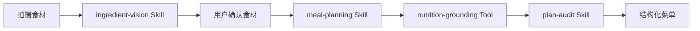
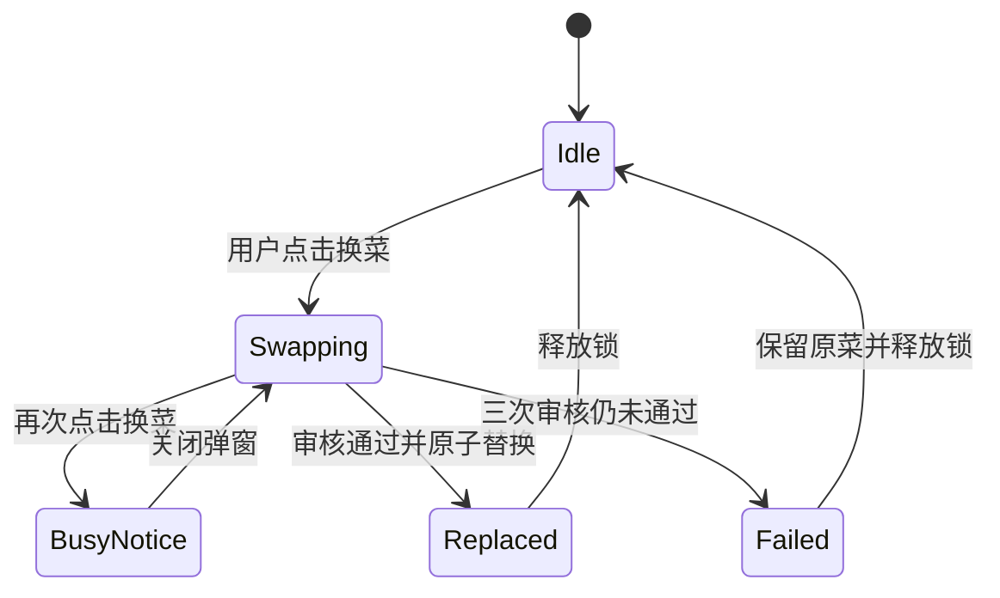

# 圆头耄耋项目入库与作品集重构 Implementation Plan

> **For agentic workers:** REQUIRED SUB-SKILL: Use superpowers:subagent-driven-development (recommended) or superpowers:executing-plans to implement this plan task-by-task. Steps use checkbox (`- [ ]`) syntax for tracking.

**Goal:** 将圆头耄耋智能配菜 Agent 的脱敏完整源码加入 Vibe Coding 作品集，并把根 README 重写为包含多个不同 Vibe Coding 作品的完整作品集首页。

**Architecture:** 保持现有两个 Notebook 和课程老师 Skill 的实现不变，只做作品集级目录整理；圆头耄耋作为独立工程目录加入。旧截图按项目移动并更新引用，新项目六张截图由根 README 与项目 README 共用。源码从已验证的 1.7 发布包提取，但明确排除内置密钥、内部计划和发布过程文件。

**Tech Stack:** Git、Markdown、Mermaid、Python/FastAPI/Pydantic、Next.js/React/TypeScript、Vitest、pytest、Docker、SQLite/USDA FoodData Central。

---

## 文件结构与职责

- `README.md`：多项目 Vibe Coding 作品集首页、项目导航、能力矩阵和方法论。
- `Skills作品/aipm-course-teacher/`：原课程老师 Skill，内容不改，只更新移动后的路径引用。
- `作品截图/`：原两个 Notebook 项目的截图，按项目分类并使用有意义文件名。
- `圆头耄耋智能配菜Agent/README.md`：圆头耄耋产品、AI 工作流和工程实现的完整案例文档。
- `圆头耄耋智能配菜Agent/backend/`：FastAPI 后端、业务 Skills、本地营养库和测试。
- `圆头耄耋智能配菜Agent/frontend/`：Next.js/React 前端、移动端交互和测试。
- `圆头耄耋智能配菜Agent/assets/`：用户提供的六张移动端截图，由两份 README 共同引用。
- `docs/superpowers/specs/2026-07-29-maodie-portfolio-publish-design.md`：已批准设计。

### Task 1: 建立安全基线并确认 Git 范围

**Files:**
- Inspect: `/Users/admin/Documents/Codex/2026-07-28/web-maodie/outputs/maodie-cloudbase-1.7.zip`
- Inspect: `README.md`
- Inspect: `.gitignore`

- [ ] **Step 1: 记录分支、工作区和待推送提交**

Run:

```bash
git status -sb
git log --oneline --decorate origin/main..HEAD
git diff --stat origin/main...HEAD
```

Expected: 当前分支为 `codex/add-maodie-portfolio`，工作区仅包含本计划文件；分支继承两个尚未推送的 AIPM Skill 提交和设计提交。

- [ ] **Step 2: 检查发布包内凭据和非公开文件**

Run:

```bash
unzip -l /Users/admin/Documents/Codex/2026-07-28/web-maodie/outputs/maodie-cloudbase-1.7.zip
unzip -p /Users/admin/Documents/Codex/2026-07-28/web-maodie/outputs/maodie-cloudbase-1.7.zip .env.example
```

Expected: 包内存在 `backend/data/.kimi-key`，因此不得整体解压入库；`.env.example` 只能含环境变量名和安全占位说明。

- [ ] **Step 3: 提交实施计划**

```bash
git add docs/superpowers/plans/2026-07-29-maodie-portfolio-publish.md
git commit -m "Plan Maodie portfolio publishing"
```

Expected: 仅计划文件进入提交。

### Task 2: 重构现有作品集目录并保留截图

**Files:**
- Move: `skills/` → `Skills作品/`
- Move: `项目demo图片/1.png` → `作品截图/AIGC电商海报Agent/01-生成页面.png`
- Move: `项目demo图片/2.png` → `作品截图/AIGC电商海报Agent/02-生成结果.png`
- Move: `项目demo图片/3.png` → `作品截图/AIGC电商海报Agent/03-海报展示.png`
- Move: `项目demo图片/4.png` → `作品截图/AI智能简历/01-对话引导.png`
- Move: `项目demo图片/5.png` → `作品截图/AI智能简历/02-简历生成.png`
- Move: `项目demo图片/6.png` → `作品截图/AI智能简历/03-简历展示.png`

- [ ] **Step 1: 创建截图分类目录**

```bash
mkdir -p "作品截图/AIGC电商海报Agent" "作品截图/AI智能简历"
```

Expected: 两个目录存在且为空。

- [ ] **Step 2: 使用 Git 移动 Skill 和六张旧截图**

```bash
git mv skills "Skills作品"
git mv "项目demo图片/1.png" "作品截图/AIGC电商海报Agent/01-生成页面.png"
git mv "项目demo图片/2.png" "作品截图/AIGC电商海报Agent/02-生成结果.png"
git mv "项目demo图片/3.png" "作品截图/AIGC电商海报Agent/03-海报展示.png"
git mv "项目demo图片/4.png" "作品截图/AI智能简历/01-对话引导.png"
git mv "项目demo图片/5.png" "作品截图/AI智能简历/02-简历生成.png"
git mv "项目demo图片/6.png" "作品截图/AI智能简历/03-简历展示.png"
```

Expected: `skills/` 和 `项目demo图片/` 不再出现；所有文件保留 Git rename 历史。

- [ ] **Step 3: 扫描旧路径引用**

```bash
rg -n 'skills/aipm-course-teacher|项目demo图片/' .
```

Expected: 只列出尚待 Task 5 更新的 Markdown 引用，不应出现脚本硬编码依赖。

### Task 3: 加入脱敏圆头耄耋源码和产品截图

**Files:**
- Create: `圆头耄耋智能配菜Agent/.dockerignore`
- Create: `圆头耄耋智能配菜Agent/.env.example`
- Create: `圆头耄耋智能配菜Agent/.gitignore`
- Create: `圆头耄耋智能配菜Agent/Dockerfile`
- Create: `圆头耄耋智能配菜Agent/dev.sh`
- Create: `圆头耄耋智能配菜Agent/backend/**`
- Create: `圆头耄耋智能配菜Agent/frontend/**`
- Create: `圆头耄耋智能配菜Agent/assets/*.jpg`
- Exclude: `圆头耄耋智能配菜Agent/backend/data/.kimi-key`

- [ ] **Step 1: 仅提取公开所需源码**

Run from repository root:

```bash
unzip -q /Users/admin/Documents/Codex/2026-07-28/web-maodie/outputs/maodie-cloudbase-1.7.zip \
  .dockerignore .env.example .gitignore Dockerfile dev.sh 'backend/*' 'frontend/*' \
  -x 'backend/data/.kimi-key' \
  -d "圆头耄耋智能配菜Agent"
```

Expected: 后端、前端、Docker 配置和测试存在，`backend/data/.kimi-key` 不存在。

- [ ] **Step 2: 拷贝并语义化命名六张新截图**

```bash
mkdir -p "圆头耄耋智能配菜Agent/assets"
cp "/Users/admin/Library/Application Support/LarkShell/sdk_storage/6589edbe80eac7c5e9c39fb038fabeed/resources/images/img_v3_02142_51a50f16-3033-4976-82dd-b57b56c8ed2g.jpg" "圆头耄耋智能配菜Agent/assets/01-首页拍摄食材.jpg"
cp "/Users/admin/Library/Application Support/LarkShell/sdk_storage/6589edbe80eac7c5e9c39fb038fabeed/resources/images/img_v3_02142_cf78cb24-a285-41ea-9c5b-7fc7ab33156g.jpg" "圆头耄耋智能配菜Agent/assets/02-菜单生成结果.jpg"
cp "/Users/admin/Library/Application Support/LarkShell/sdk_storage/6589edbe80eac7c5e9c39fb038fabeed/resources/images/img_v3_02142_ec8fad76-e31a-478b-a38c-50256a97b85g.jpg" "圆头耄耋智能配菜Agent/assets/03-Agent执行记录.jpg"
cp "/Users/admin/Library/Application Support/LarkShell/sdk_storage/6589edbe80eac7c5e9c39fb038fabeed/resources/images/img_v3_02142_540a3941-5210-4474-a302-5ee6bf08be0g.jpg" "圆头耄耋智能配菜Agent/assets/04-换菜全局忙锁.jpg"
cp "/Users/admin/Library/Application Support/LarkShell/sdk_storage/6589edbe80eac7c5e9c39fb038fabeed/resources/images/img_v3_02142_fcbe8cc1-5881-4526-aed8-1d79679394dg.jpg" "圆头耄耋智能配菜Agent/assets/05-菜品热量详情.jpg"
cp "/Users/admin/Library/Application Support/LarkShell/sdk_storage/6589edbe80eac7c5e9c39fb038fabeed/resources/images/img_v3_02142_86396cb4-25b4-4455-a496-767b6b716a9g.jpg" "圆头耄耋智能配菜Agent/assets/06-做菜步骤引导.jpg"
```

Expected: 六张 JPG 均存在且文件大小大于 0。

- [ ] **Step 3: 增强项目级忽略规则**

Modify `圆头耄耋智能配菜Agent/.gitignore`，确保至少包含：

```gitignore
.env
.env.*
!.env.example
backend/data/.kimi-key
__pycache__/
.pytest_cache/
node_modules/
.next/
out/
coverage/
*.log
```

- [ ] **Step 4: 扫描脱敏结果**

```bash
find "圆头耄耋智能配菜Agent" -name '.kimi-key' -o -name '.env'
rg -n --hidden -S '(sk-[A-Za-z0-9_-]{20,}|MOONSHOT_API_KEY\s*=\s*[^<[:space:]]+|KIMI_API_KEY\s*=\s*[^<[:space:]]+)' "圆头耄耋智能配菜Agent"
```

Expected: 第一条无输出；第二条不得发现真实密钥，只允许测试中的显式假值和 `.env.example` 占位说明。

### Task 4: 编写圆头耄耋项目 README

**Files:**
- Create: `圆头耄耋智能配菜Agent/README.md`

- [ ] **Step 1: 写产品案例首屏与截图画廊**

README 首屏必须包含：

```markdown
# 圆头耄耋智能配菜 Agent

> 拍下冰箱现有食材，由 AI 识别、规划低热量菜单，并使用 USDA FoodData Central 数据按实际克数重算热量。
```

随后用 HTML 表格或宽度受控的 `` 标签展示六张 `assets/*.jpg`，确保 GitHub 页面不会按手机原尺寸纵向撑满。

- [ ] **Step 2: 写产品分析与用户工作流**

必须具体覆盖：

- “有食材但不知道做什么”“低卡信息不可核验”“换菜容易破坏库存约束”三个问题。
- 拍照识别、人工确认、设置人数/餐数/厨具/忌口、生成菜单、查看菜谱、换菜、步骤跟做。
- 产品目标、非目标和适合场景，不编造用户量、转化率或商业成绩。

- [ ] **Step 3: 写 AI 与工程工作流**

必须包含两张 Mermaid 图：





正文解释 LLM、Skill、Tool、Pydantic 合约、确定性 Python、USDA SQLite 和前端状态机的职责边界。

- [ ] **Step 4: 写技术栈、接口、测试、部署和取舍**

准确列出 FastAPI、Pydantic、Uvicorn、Next.js、React、TypeScript、Zod、Vitest、Testing Library、SQLite、Docker、Kimi/Moonshot API。写明端口 `8080`、CloudBase 建议最小实例数 `0`、最大实例数 `1`，并解释内存状态在缩容后的限制。

### Task 5: 重写多项目作品集根 README

**Files:**
- Modify: `README.md`

- [ ] **Step 1: 重写仓库定位与项目导航**

首屏必须明确使用以下意思完整的一句话：

```markdown
这是一个包含多个不同 Vibe Coding 作品的个人作品集仓库，记录我如何把产品洞察、AI 工作流设计和工程实现组合成可以运行、验证和复盘的原型。
```

项目导航包含四项，并使用真实相对链接：

```markdown
- [圆头耄耋智能配菜 Agent](圆头耄耋智能配菜Agent/)
- [AI 产品经理课程老师 Skill](Skills作品/aipm-course-teacher/)
- [AIGC 电商海报及文案制作 Agent](AIGC电商海报及文案制作Agent.ipynb)
- [智聘 Agent · AI 智能简历](AI智能简历.ipynb)
```

- [ ] **Step 2: 写能力矩阵和通用 Vibe Coding 工作流**

能力矩阵至少覆盖产品洞察、交互设计、Agent/Skill/Tool 编排、Prompt/Schema 约束、前后端开发、测试验证和部署复盘；每项必须链接到真实项目证据，不能写空泛形容词。

- [ ] **Step 3: 重点介绍圆头耄耋并展示六图**

根 README 用 `圆头耄耋智能配菜Agent/assets/*.jpg` 展示六张截图，解释识别、菜单、Agent 轨迹、换菜忙锁、热量溯源和步骤模式。正文链接到项目 README 阅读完整技术分析。

- [ ] **Step 4: 更新其余三个项目和旧截图引用**

把原 `项目demo图片/*.png` 改为：

```markdown
作品截图/AIGC电商海报Agent/01-生成页面.png
作品截图/AIGC电商海报Agent/02-生成结果.png
作品截图/AIGC电商海报Agent/03-海报展示.png
作品截图/AI智能简历/01-对话引导.png
作品截图/AI智能简历/02-简历生成.png
作品截图/AI智能简历/03-简历展示.png
```

更新所有 `skills/aipm-course-teacher/` 为 `Skills作品/aipm-course-teacher/`。

### Task 6: 验证源码、文档和安全性

**Files:**
- Test: `圆头耄耋智能配菜Agent/backend/tests/`
- Test: `圆头耄耋智能配菜Agent/frontend/tests/`
- Verify: `README.md`
- Verify: `圆头耄耋智能配菜Agent/README.md`

- [ ] **Step 1: 安装并运行后端测试**

```bash
cd "圆头耄耋智能配菜Agent"
python3 -m venv backend/.venv
backend/.venv/bin/pip install -r backend/requirements.txt
PYTHONDONTWRITEBYTECODE=1 PYTHONPATH=backend \
  backend/.venv/bin/python -m unittest discover \
  -s backend/tests -p 'test_*.py' -q
```

Expected: 170 个后端 unittest 全部通过；`backend/.venv/` 被 `.gitignore` 排除。

- [ ] **Step 2: 安装并运行前端测试**

```bash
cd "圆头耄耋智能配菜Agent/frontend"
npm ci
npm test -- --run
npm run build
```

Expected: Vitest 全部通过且 Next.js 静态构建成功；`node_modules/`、`.next/` 和 `out/` 未进入 Git。

- [ ] **Step 3: 校验 Markdown 本地链接与图片**

Run a small read-only validator that extracts `README.md` 与 `圆头耄耋智能配菜Agent/README.md` 中的相对路径，并 verifies every referenced local file exists。

Expected: 两份 README 的本地链接和图片均为 0 个缺失。

- [ ] **Step 4: 执行全仓密钥扫描和 diff 检查**

```bash
find . -name '.kimi-key' -o -name '.env' -o -name '__pycache__' -o -name 'node_modules'
rg -n --hidden -S '(sk-[A-Za-z0-9_-]{20,}|AKID[A-Za-z0-9]{13,}|-----BEGIN (RSA |EC |OPENSSH )?PRIVATE KEY-----)' . -g '!.git/**'
git diff --check
git status -sb
```

Expected: 不存在真实密钥或被跟踪缓存；`git diff --check` 无输出；状态只包含本计划范围。

### Task 7: 提交并发布 GitHub

**Files:**
- Stage: 本计划涉及的全部目录和 README

- [ ] **Step 1: 检查最终改动统计和关键 diff**

```bash
git diff --stat
git diff -- README.md "圆头耄耋智能配菜Agent/README.md"
git status --short
```

Expected: 没有用户无关文件；源码、截图、目录移动和两份 README 均在范围内。

- [ ] **Step 2: 提交作品集更新**

```bash
git add README.md "Skills作品" "作品截图" "圆头耄耋智能配菜Agent"
git commit -m "Add Maodie AI cooking agent portfolio"
```

Expected: 提交成功，工作区干净。

- [ ] **Step 3: 推送功能分支**

```bash
git push -u origin codex/add-maodie-portfolio
```

Expected: GitHub 远端创建同名分支，且包含原先两个未推送 AIPM 提交、设计、计划和作品集更新。

- [ ] **Step 4: 创建并合并发布路径**

优先使用 GitHub App 创建从 `codex/add-maodie-portfolio` 到 `main` 的 PR。PR 描述必须总结目录迁移、脱敏源码、两份 README、测试结果和密钥扫描结果。若用户希望作品立刻出现在默认分支，则在检查通过后将 PR 标记为 ready 并由用户合并；没有明确授权时不自动合并。
