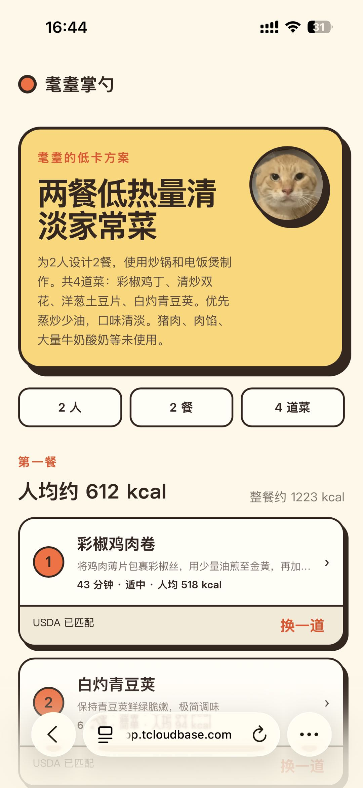
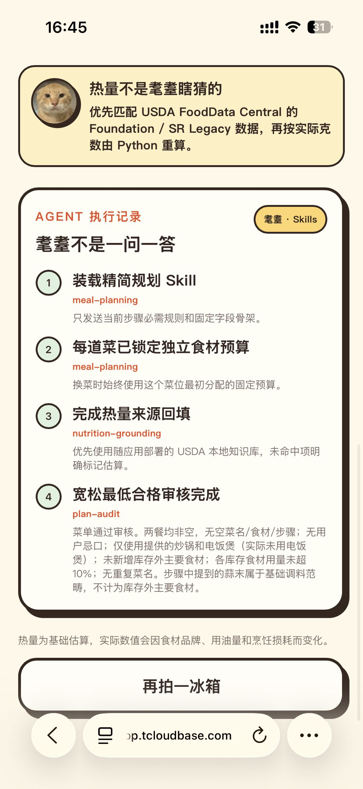
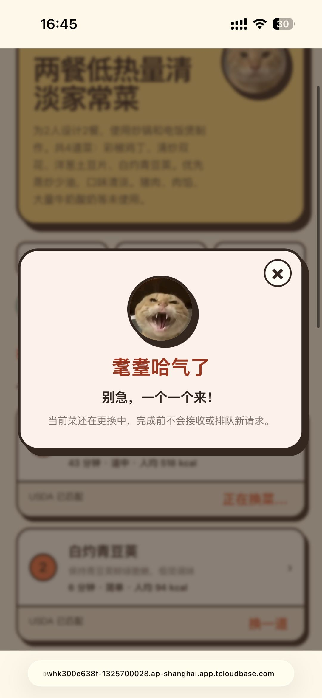
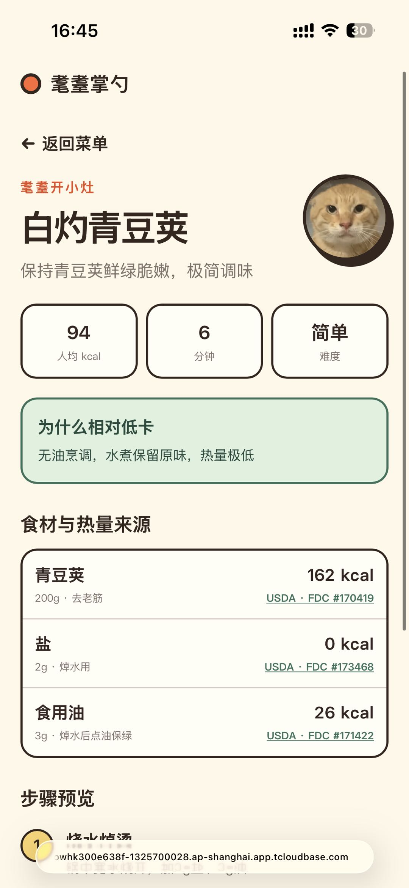
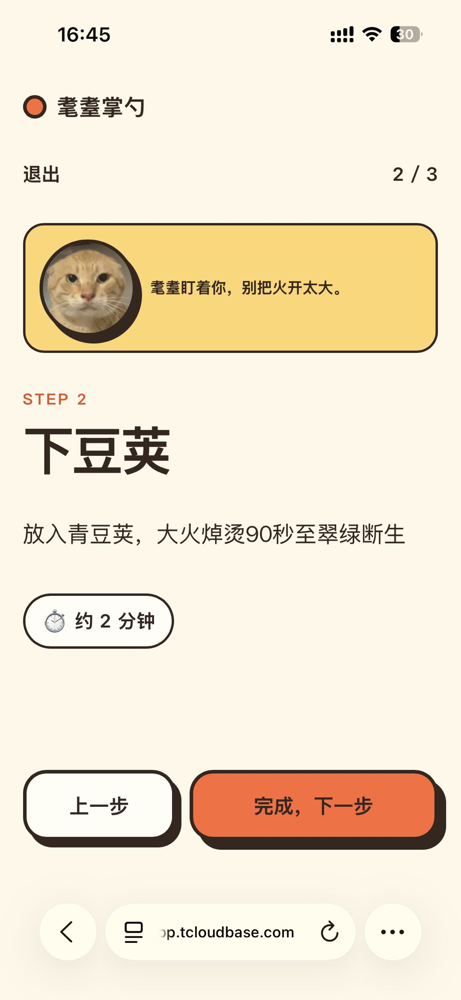
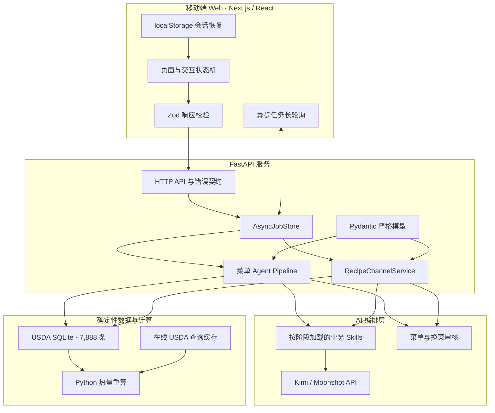
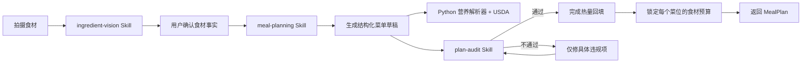
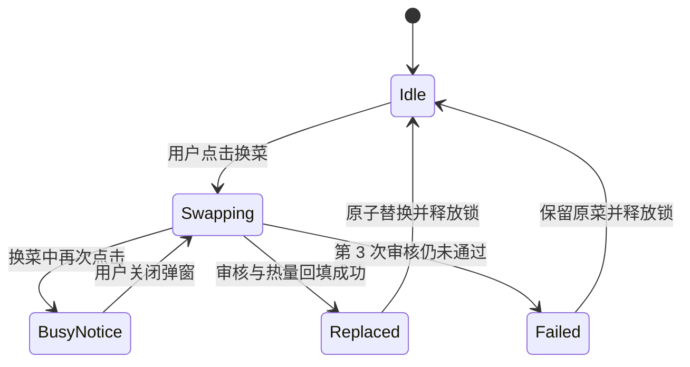

# 圆头耄耋智能配菜 Agent

> 拍下冰箱现有食材，由 AI 识别、规划低热量菜单，并使用 USDA FoodData Central 数据按实际克数重算热量。

圆头耄耋不是一个“输入一句话、让模型随便报几道菜”的聊天机器人。它把视觉识别、人工校正、菜单规划、结构化约束、营养数据检索、宽松审核、定向返工和按需换菜组合成一条可运行的 AI 产品工作流。

项目同时包含移动端 Web、FastAPI 后端、业务 Skills、本地 USDA SQLite 知识库、异步任务系统、完整接口契约和前后端测试，可通过 Docker 部署到 CloudBase 等容器平台。

## 产品截图

<table>
  <tr>
    <td align="center"><br><b>1. 拍摄或选择食材照片</b></td>
    <td align="center"><br><b>2. 生成按餐次组织的菜单</b></td>
    <td align="center"><br><b>3. 展示 Skills 与营养回填记录</b></td>
  </tr>
  <tr>
    <td align="center"><br><b>4. 换菜中拒绝新请求</b></td>
    <td align="center"><br><b>5. 逐项展示 USDA 热量来源</b></td>
    <td align="center"><br><b>6. 进入逐步烹饪模式</b></td>
  </tr>
</table>

## 一、它在解决什么问题

### 1. 冰箱里有食材，但用户仍然不知道做什么

普通菜谱产品要求用户先知道自己想搜什么；真实场景往往相反：用户面对一堆零散食材，不清楚能组合成几道菜，也不愿逐项录入库存。

圆头耄耋把入口改成“拍下现有食材”。AI 先完成视觉盘点，用户再修改名称和估算克数，降低录入成本，同时保留人在关键事实上的最终确认权。

### 2. “低卡”经常只有结论，没有可核验依据

大模型可以生成看起来合理的热量数字，但这些数字不应该被直接当作营养事实。项目把“创意生成”和“数值计算”拆开：

- LLM 负责设计菜品、用量和步骤。
- USDA FoodData Central 提供每 100g 热量基准。
- Python 按 `克数 × kcal/100g ÷ 100` 重算单项、菜品、餐次和人均热量。
- 无法匹配权威数据的项目必须标记为“耄耋估算”，不能伪造 FDC ID 或来源链接。

### 3. 换菜容易破坏原菜单的库存约束

如果每次换菜都重新看整个冰箱库存，大模型可能侵占其他菜位的食材，或者随着反复换菜不断缩减可用量。项目因此引入“菜位”：

- 初次生成菜单时，为每一道菜锁定一份独立食材预算。
- 之后无论换多少次，都始终使用该菜位**最初分配的固定预算**。
- 换菜不会读取或占用其他菜位的食材。
- 只有新菜生成、审核和热量回填全部成功后，才原子替换当前菜。
- 任一步失败，原菜保持不动。

## 二、目标用户与使用场景

### 目标用户

- 有现成食材，但缺少搭配思路的家庭做饭用户。
- 想控制相对热量，又不想手工查询营养数据的用户。
- 希望快速得到“能直接下厨”步骤，而不只是菜名推荐的用户。
- 想用现有厨具和忌口条件约束结果的用户。

### 典型场景

1. 下班回家拍一张冰箱照片，规划当晚一餐。
2. 周末把现有食材分配成 2–4 餐，减少浪费。
3. 菜单里某一道不想吃，只更换这一道，不推翻整份菜单。
4. 做菜前查看每项食材的克数、热量来源和分步操作。

### 产品目标

- 降低库存录入和菜单决策成本。
- 输出遵守人数、忌口、厨具和库存的可执行菜品。
- 让热量数字具有来源、计算过程和降级标识。
- 让长时间 AI 任务具备进度反馈、失败重试和状态保护。

### 明确不做

- 不提供疾病诊断、医疗营养方案或减重承诺。
- 不把视觉估算的重量包装成精确称重结果。
- 不为了“看起来丰富”强行用完全部库存或凑菜数。
- 不在换菜时后台预生成备用菜。
- 不支持多实例共享菜单状态；当前版本面向单实例原型验证。

## 三、完整用户旅程

| 阶段 | 用户动作 | 系统行为 | 关键设计 |
| --- | --- | --- | --- |
| 1. 拍摄 | 拍照或从相册选择 | 浏览器压缩图片并提交识别任务 | 移动端优先，避免上传超大原图 |
| 2. 识别 | 等待识别结果 | `ingredient-vision` Skill 只盘点可见食材 | 不在识别阶段生成菜谱 |
| 3. 校正 | 修改名称、克数，删除或补充食材 | 前端限制数量、名称长度和重量范围 | 用户确认事实，AI 不垄断判断 |
| 4. 设定 | 选择人数、餐数、厨具、口味和忌口 | 构造严格 `GeneratePlanRequest` | 约束先于创意 |
| 5. 规划 | 点击生成菜单 | 规划、热量回填与审核通过异步任务执行 | 长轮询持续返回进度 |
| 6. 看菜单 | 查看餐次、菜品、人均热量 | 展示菜位、USDA 匹配状态和 Agent 轨迹 | 结果可解释、可追踪 |
| 7. 换菜 | 对单道菜点击“换一道” | 按该菜位固定预算现做一道新菜 | 不准备备用菜，不影响其他菜 |
| 8. 做菜 | 打开菜谱并逐步操作 | 展示食材来源、用时、火候和步骤 | 从推荐闭环到实际执行 |

## 四、系统架构



项目采用“LLM 负责语义、代码负责边界”的分工：

| 层级 | 负责什么 | 不负责什么 |
| --- | --- | --- |
| LLM | 识别可见食材、设计菜品、根据违规项定向返工 | 不直接决定最终热量，不管理并发锁 |
| Skill | 给每个阶段加载最小且明确的业务规则 | 不保存运行状态，不直接修改菜单 |
| 营养解析器 / 数据库 | 由 Python 直接匹配 USDA 数据并返回可追溯来源 | 不设计菜品，不评价口味 |
| Pydantic / Zod | 限制字段、类型、枚举和前后端契约 | 不替代业务审核 |
| Python 服务 | 热量计算、库存归一、版本校验、锁、原子替换 | 不做主观创意判断 |
| React 状态机 | 页面跳转、忙碌弹窗、重试和结果呈现 | 不在前端伪造后端完成状态 |

## 五、Agent、Skill 与 Tool 工作流

### 5.1 初次菜单生成



生成流程不是无限循环：

1. `meal-planning` 生成一份完整菜单草稿。
2. 服务端归一化库存名称和用量。
3. 热量计算与 LLM 宽松审核并行执行，减少等待时间。
4. 审核只拦截空内容、忌口、错误厨具、库存外主要食材、明确超量和同名重复菜等基础错误。
5. 不通过时把具体违规项交回模型定向修复。
6. 最多审核 3 次、返工 2 次；仍不通过则任务失败并提示重新生成。
7. 审核通过后，为每道菜建立 `RecipeChannel`，并保存后续换菜始终复用的固定 `ingredientBudget`。

### 5.2 版本化业务 Skills

| Skill | 职责 | 关键边界 |
| --- | --- | --- |
| `ingredient-vision` | 从图片盘点可校正的食材事实 | 不生成菜谱、不做健康评价 |
| `meal-planning` | 根据库存、人数、餐数、厨具和忌口设计菜单 | 不直接写最终热量 |
| `nutrition-grounding` | 记录 USDA 匹配与降级策略 | 当前策略由 Python 营养解析流程直接执行，不是模型自主 Tool Call |
| `plan-audit` | 对完整菜单做宽松最低合格审核 | 只查明确基础错误，不追求“完美” |
| `recipe-channel-swap` | 使用单菜位固定预算生成一道新菜 | 不读取其他菜位，不生成备用菜 |
| `recipe-channel-audit` | 审核单个替换菜并给出具体违规项 | 不把创意不足或个人偏好判为失败 |

Skills 以独立 `SKILL.md` 文件保存。视觉识别、菜单规划、菜单审核、换菜生成和换菜审核会按运行阶段加载到 Kimi system prompt；`nutrition-grounding` 作为版本化策略文档存在，当前生产流程由 Python 直接调用 USDA 解析器，并没有让模型自主选择或调用营养 Tool。这样的边界避免把确定性数据检索交给模型自由决策。

### 5.3 USDA 营养回填

项目内置一个约 2.3MB 的 SQLite 知识库：

| 数据集 | 条目数 |
| --- | ---: |
| USDA Foundation Foods | 95 |
| USDA SR Legacy | 7,793 |
| 合计 | 7,888 |

营养匹配顺序：

1. 使用模型提供的主要英文查询词检索本地库。
2. 未命中时使用更宽的备用查询词。
3. 本地仍未命中时，最多联网查询一次 USDA。
4. 在线结果写入运行时 SQLite 缓存。
5. 完全未命中时采用模型估值，但设置 `estimated=true`。

模型只提供候选查询词和兜底估值，最终数值由 Python 计算。前端会展示 FDC ID 和来源链接，帮助用户区分权威匹配与估算。

## 六、换菜为什么单独设计成状态机

换菜同时涉及长耗时 LLM 调用、库存一致性、重复点击和失败回滚。如果只用一个按钮加一次 HTTP 请求，容易出现两个请求同时修改菜单、旧结果覆盖新结果或失败后原菜丢失。



### 固定食材预算

`derive_channel_budget()` 在初次菜单完成时，根据该菜实际分配到的库存生成预算。后续换菜传入的永远是 `channel.ingredientBudget`，不会根据上一次替换菜重新计算，因此连续换菜不会“越换越少”。

### 全局忙锁，不排队

`RecipeChannelService` 只维护一个 `_active_swap_job_id`：

- 空闲时接受一个换菜任务。
- 换菜中再次请求，后端立即返回 `REPLACEMENT_BUSY`，不创建任务、不排队。
- 前端在本地也用 `swapBusyRef` 拦截第二次点击，弹出“耄耋哈气了”模态窗口。
- 用户点击“×”只关闭提示，已经进行中的换菜不会取消。
- 如果后台仍在换菜，下一次点击会再次弹出提示。

### 三次审核、两次定向返工

每轮生成后调用 `recipe-channel-audit`：

1. 第一次生成候选菜并审核。
2. 不通过时，将候选菜和具体违规项交回 `recipe-channel-swap`，只修这些问题。
3. 最多进行 3 次审核，对应最多 2 次返工。
4. 任意一次通过后，再进行 USDA 热量回填。
5. 第三次仍不通过，则返回失败，释放忙锁，原菜完全不动。

### 原子替换与版本校验

请求同时携带菜单版本和菜位版本。新菜完成时再次校验版本；只有版本仍一致，服务才把 `current` 一次性替换并递增 revision。幂等键避免同一次点击被重复执行。

## 七、异步任务与接口设计

识别、菜单生成和换菜都可能经历多次模型调用，因此生产交互使用异步 Job API：

| 方法 | 路径 | 用途 |
| --- | --- | --- |
| `GET` | `/__tcb_probe__` | CloudBase 容器探针 |
| `GET` | `/api/health` | 服务、模型、Skill 版本和营养库健康状态 |
| `POST` | `/api/ingredients/recognize` | 同步识别接口，便于直接集成或调试 |
| `POST` | `/api/ingredients/jobs` | 创建食材识别任务 |
| `GET` | `/api/ingredients/jobs/{job_id}` | 长轮询识别进度 |
| `POST` | `/api/plans/generate` | 同步生成并注册菜单 |
| `POST` | `/api/plans/jobs` | 创建菜单生成任务 |
| `GET` | `/api/plans/jobs/{job_id}` | 长轮询菜单进度 |
| `GET` | `/api/plans/{plan_id}` | 读取当前菜单 |
| `POST` | `/api/plans/channel-swaps` | 创建单菜位换菜任务 |
| `GET` | `/api/plans/channel-swap-jobs/{job_id}` | 长轮询换菜进度 |

移动端生产交互使用异步接口，但同步识别和同步菜单接口仍然保留。前端每次最多等待 25 秒获得 Job 更新；连续第 3 次轮询网络失败时终止，也就是初次失败后再尝试 2 次。后端 `AsyncJobStore` 使用信号量限制同时执行的 Kimi Job 数，并为识别、生成和换菜设置独立超时。

所有错误统一返回：

```json
{
  "error": {
    "code": "REPLACEMENT_BUSY",
    "message": "别急，一个一个来！",
    "retryable": true
  }
}
```

相比只传字符串，这种错误契约允许前端根据错误类型决定展示、重试或终止。

## 八、技术栈

| 范围 | 技术 | 选型理由 |
| --- | --- | --- |
| AI 模型 | Kimi / Moonshot API，默认 `kimi-k2.6` | 支持图像输入、结构化输出和较长任务 |
| 后端 | Python 3.12、FastAPI、Uvicorn | 异步接口清晰，适合编排外部模型调用 |
| 数据契约 | Pydantic 2 | 严格模型、JSON Schema 和错误定位 |
| HTTP 客户端 | HTTPX | 异步调用 Kimi 与 USDA |
| 营养数据 | SQLite、FTS5、USDA FoodData Central | 可随容器部署、可追溯、低运行成本 |
| 前端 | Next.js 16、React 19、TypeScript 5.9 | 移动端单页体验与静态导出 |
| 前端校验 | Zod 4 | 运行时检查领域对象与换菜响应；通用识别/菜单 Job 结果仍有继续收紧空间 |
| 测试 | unittest、Vitest、Testing Library | 覆盖业务规则、契约和交互状态 |
| 部署 | Docker 多阶段构建、CloudBase 云托管 | 一个容器同时提供静态前端和 API |

## 九、前端交互设计

### 移动端优先

- 对移动设备使用相机选择器，对桌面和 iPadOS 做兼容判断。
- 图片在浏览器中压缩后再上传，减少请求体和识别等待。
- 页面采用强对比边框、大按钮和底部固定主操作，适合单手使用。
- 浏览器历史记录映射到首页、食材、设置、结果、菜谱和烹饪步骤，返回键不会随意跳出流程。

### 状态恢复

前端将菜单、确认后的食材、约束和进行中的换菜元数据写入 `localStorage`。刷新后可以恢复当前页面，并尝试查询正在执行的任务。

需要注意：后端菜单与任务仍保存在进程内存中。容器缩容或重启后，前端虽然还保存界面快照，但旧 `planId` 可能已经失效，需要重新生成。

### 错误反馈

- 识别和菜单生成失败进入完整错误页，并保留“再试一次”动作。
- 单道换菜失败只在对应菜单结果中提示，不摧毁整份菜单。
- 忙碌提示使用模态窗口阻止背景误操作，但关闭窗口不会取消后台任务。
- 使用 `role="dialog"`、`aria-modal` 和 `role="alert"` 等语义帮助辅助技术理解当前状态。

## 十、代码结构

```text
圆头耄耋智能配菜Agent/
├── README.md
├── Dockerfile
├── .env.example
├── backend/
│   ├── app/
│   │   ├── main.py          # FastAPI 路由与错误契约
│   │   ├── agent.py         # 初次菜单 Agent Pipeline
│   │   ├── channels.py      # 菜位、固定预算、换菜锁与原子替换
│   │   ├── jobs.py          # 异步任务和长轮询状态
│   │   ├── kimi.py          # 模型调用、限流和结构化输出修复
│   │   ├── nutrition.py     # USDA 本地/在线检索与缓存
│   │   ├── calories.py      # 确定性热量重算
│   │   ├── models.py        # Pydantic 数据模型
│   │   └── prompts.py       # 紧凑事实快照与消息构造
│   ├── skills/              # 版本化业务 Skill 与营养策略
│   ├── data/nutrition.db    # USDA 本地知识库
│   └── tests/
├── frontend/
│   ├── app/                 # Next.js 页面与全局样式
│   ├── components/          # 主交互组件
│   ├── lib/                 # API、Zod 契约、导航、会话和图片处理
│   ├── public/              # 耄耋头像素材
│   └── tests/
├── work/e2e_adversarial.py  # 离线对抗验收入口
└── assets/                  # README 产品截图
```

## 十一、本地运行

### 环境要求

- Python 3.12+
- Node.js 22+
- 一个有效的 Moonshot API Key

### 1. 配置环境变量

```bash
cp .env.example .env
```

编辑 `.env`：

```dotenv
MOONSHOT_API_KEY=<your-moonshot-api-key>
MOONSHOT_BASE_URL=https://api.moonshot.cn/v1
KIMI_MODEL=kimi-k2.6
```

仓库不包含真实密钥。`.env`、`.env.*` 和 `backend/data/.kimi-key` 已被 Git 忽略。

### 2. 启动开发环境

```bash
cd backend
python3 -m venv .venv
.venv/bin/pip install -r requirements.txt
cd ../frontend
npm ci
cd ..
./dev.sh
```

也可以分别启动：

```bash
cd backend
python3 -m venv .venv
.venv/bin/pip install -r requirements.txt
PYTHONDONTWRITEBYTECODE=1 .venv/bin/uvicorn app.main:app --reload --port 8000
```

```bash
cd frontend
npm ci
npm run dev
```

前端默认访问 `http://localhost:3000`，后端访问 `http://localhost:8000`。

## 十二、Docker 与 CloudBase 部署

```bash
docker build -t maodie-agent .
docker run --rm \
  -p 8080:8080 \
  -e MOONSHOT_API_KEY="<your-moonshot-api-key>" \
  maodie-agent
```

CloudBase 建议：

- 容器端口：`8080`
- 最小实例数：`0`
- 最大实例数：`1`
- 低流量原型可先使用 `0.25 核 / 0.5GB`
- 通过环境变量配置 `MOONSHOT_API_KEY`

为什么最大实例数建议为 1：当前菜单、任务、幂等记录和全局换菜锁都保存在单进程内存中。直接扩到多个实例会让不同请求看到不同状态。面向真实多实例生产环境时，应先把这些状态迁移到 Redis 或数据库。

为什么最小实例数建议为 0：无人使用时允许缩容，避免容器全天常驻。代价是冷启动，以及缩容后内存菜单失效。

## 十三、测试策略

后端测试覆盖：

- 图片格式、大小和请求输入边界。
- Pydantic 严格契约与结构化响应修复。
- 菜单审核、定向返工次数和 Prompt 预算。
- USDA 本地匹配、状态冲突、在线降级和缓存。
- 菜位固定预算、幂等、revision 冲突和原子替换。
- 全局忙锁、失败释放锁、第三次审核失败保留原菜。
- Kimi 限流、超时和上游错误映射。

前端测试覆盖：

- Zod 契约和 API 错误处理。
- 25 秒长轮询、网络重试和任务恢复。
- 图片压缩与 Safari/iPadOS 文件选择。
- 页面导航、localStorage 恢复和非法状态降级。
- 换菜忙碌弹窗、关闭弹窗不取消任务、失败后“再换一次”。

运行：

```bash
PYTHONDONTWRITEBYTECODE=1 PYTHONPATH=backend \
  backend/.venv/bin/python -m unittest discover \
  -s backend/tests -p 'test_*.py' -q
```

```bash
cd frontend
npm ci
npm test
npm run lint
npm run build
```

当前公开版在 2026-07-29 的本地验证结果：

- 后端 `unittest`：170 项通过。
- 前端 Vitest：7 个测试文件、33 项通过。
- TypeScript 无输出类型检查通过。
- Next.js 生产静态构建通过。
- 当前验证环境未安装 Docker，因此没有把“镜像构建成功”写成已经完成的验证结论；部署前应在具备 Docker 的环境再跑一次上面的构建与启动命令。

## 十四、安全与隐私

- 公开仓库不包含 Kimi Key；只能通过环境变量注入。
- 图片在提交模型前进行类型、Base64 和大小校验。
- 后端 Pydantic 对请求和响应做严格建模；前端 Zod 校验领域对象和关键换菜响应。
- API 不记录用户上传图片内容到数据库。
- 当前实现不提供用户账号和云端历史记录。
- USDA 本地库来自公开数据集；在线查询结果仅缓存营养匹配，不缓存用户照片。

## 十五、关键产品与工程取舍

| 决策 | 得到什么 | 付出什么 |
| --- | --- | --- |
| 用户确认识别结果 | 降低视觉误判传导 | 多一步操作 |
| 本地 USDA 优先 | 可追溯、低延迟、低外部依赖 | 需要随版本更新数据 |
| 宽松最低合格审核 | 避免模型因主观偏好反复卡住 | 不追求每道菜“最优” |
| 不生成备用菜 | 减少无效模型调用和状态复杂度 | 换菜必须等待现场生成 |
| 全局换菜锁 | 状态简单、不会并发覆盖 | 同时只能换一道菜 |
| 内存状态 | 原型开发快、部署简单 | 重启丢状态、不能水平扩容 |
| 单体容器 | 一次部署前后端 | 前后端不能独立伸缩 |

## 十六、已知局限与下一步

### 当前局限

- 图片识别和菜品设计质量仍受模型能力影响。
- 重量来自视觉估算或用户输入，不等同于电子秤测量。
- 热量是基于原料克数的基础估算，实际值会受品牌、可食部、用油和烹饪损耗影响。
- 菜单、Job 和换菜锁保存在内存，服务重启后失效。
- 当前没有用户体系、持久历史、多人协作或运营后台。
- 换菜是全局串行，适合当前单用户原型，不适合高并发。

### 可演进方向

1. 使用 Redis 保存 Job、幂等键和全局锁，支持多实例。
2. 使用持久数据库保存用户菜单和食材历史。
3. 建立真实菜谱与营养专家评测集，而不只依赖规则和 LLM 审核。
4. 增加食材条码、保质期和库存消耗记录。
5. 增加成本、缓存命中率、模型延迟和审核通过率监控。

## 写在最后

这个项目最重要的实践不是“让大模型生成菜谱”，而是把一个模糊能力拆成多个可控制环节：

> 用 Skill 约束语义，用 Schema 约束格式，用 Tool 提供事实，用确定性代码计算数值，用状态机守住并发和失败边界。

这也是我对 Vibe Coding 的理解：不把 AI 当作替代思考的黑箱，而是用产品判断定义问题，再用 AI 和工程手段把想法快速做成可以运行、测试和复盘的产品。
