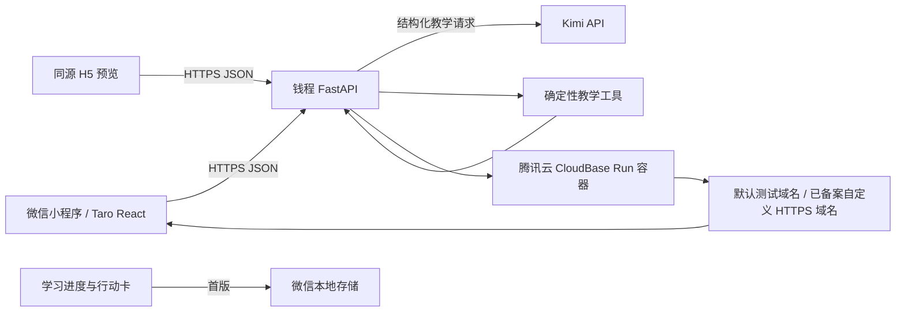

# 钱程：微信小程序正式版与腾讯云部署计划

> 状态：待确认。本文只定义开发与上线路径，不执行代码修改、账号授权或云部署。

## Goal

在 2026-09-04 前完成可演示、可在微信开发者工具预览的「钱程」理财启蒙课程小程序，并具备部署到腾讯云云托管的后端。产品不是聊天机器人，而是一套固定教学主线、因人而异反馈的 6 节互动课：每节 10–20 分钟、6–8 个有认知负荷的连续教学回合、至少 2 次 AI 追问/点评、1 张可带走的行动卡。

上线前的每一个需要登录、实名认证、付费、提交资质、配置域名或提交微信审核的步骤，都暂停并由我用清单逐步带你操作；绝不要求你把 API Key 发到聊天里。

## 产品边界与成功标准

### 做什么

1. 六节完整课程，而不是六张介绍卡：
   - 第 1 课《工资到账后，钱怎么分工》：给钱贴任务标签、遭遇临时支出、重新安排。
   - 第 2 课《先给生活装一把伞》：识别生活保障、家庭责任分支、突发事件后的安全垫。
   - 第 3 课《产品不是名字，是任务》：把不同目标拖进「随时要用 / 稳稳长大 / 长期可能波动」地图。
   - 第 4 课《收益、风险和时间的跷跷板》：拉动三枚滑杆，在同一目标下看取舍变化。
   - 第 5 课《把未来日期放到今天》：在时间轴上安排目标与现金流，处理日期冲突。
   - 第 6 课《市场热闹时，先按暂停》：识别高收益诱导、熟人推荐与涨跌情绪，练习暂停、核实、再决定。
2. 固定课程骨架 + 动态教学反馈。每个人经历相同的核心概念与安全边界；AI 仅根据其选择、文字理由、已掌握/易混淆点改变追问、例子、反馈措辞和下一题情境。
3. 小程序原生交互优先，且有同源 H5 预览版；不再以 `web-view` 嵌入本地网页。
4. Python/FastAPI 服务端保管 Kimi 密钥，生成受约束的教学反馈并记录匿名化可选反馈。

### 不做什么（本期）

1. 不提供任何个股、基金、保险或真实交易建议；全程是理财启蒙模拟。
2. 不做自由开放式聊天入口、社区、排行榜、支付或真实账户资产连接。
3. 不在容器本地写学习数据；云托管容器是无状态的。
4. 不为上线强行购买服务器或提前接数据库。首版把学习进度存在微信本地，服务端无状态，降低部署与隐私复杂度。

### 验收指标

- 六门课均可从首页进入；每门课至少 6 个连续教学回合，其中至少 2 回合要求用户解释、比较或应对新条件，不能靠连续点击/拖拽在数分钟内完成。完成时生成行动卡和「讲给我听」总结。
- 每节课的两次 AI 点评均真实调用后端；断网或未配置密钥时可清晰降级为本地教学提示，绝不伪称 AI 已回复。
- 用户每完成一个回合即自动保存；退出、断网、切换页面或重进小程序后均回到该课未完成的下一步。每节课提供二次确认后的「从头开始」，仅清除该课进度。
- H5 在手机宽度 375px、桌面宽度均正常；小程序在微信开发者工具中可编译、预览。
- API 通过 Python 单元测试、契约测试、Kimi 模拟测试和容器健康检查。
- 云端密钥只存在腾讯云环境变量，不进入 Git、前端包、日志或截图。

## Architecture

关键原则：UI 决定「此刻在第几步、可做什么」，后端决定「基于这次答案如何解释」。Kimi 永远不能决定跳关、修改正确/错误、生成投资建议或覆盖课程主线。详细的三轨状态、课件约束和自由聊天机制见 `docs/superpowers/specs/2026-08-30-flexible-course-agent-design.md`。

## Tech Stack

| 区域 | 选型 | 原因 |
| --- | --- | --- |
| 小程序与 H5 | Taro 4 + React + TypeScript + Sass | 一套 React 代码编译到微信小程序和 H5；适合把课程做成状态机，不会把网页硬塞进小程序。 |
| 小程序交互 | Taro 原生组件、`MovableArea/MovableView`、触摸事件、CSS 动效 | 拖拽钱卡、滑杆、时间轴在微信端稳定可控；核心互动不依赖浏览器 DOM。 |
| 基础 UI | 自定义课程视觉；可用 Vant Weapp 做 Toast、Dialog、Loading 的兼容性试验 | 保持产品有辨识度；组件库只做系统控件，不主导课程体验。 |
| 可选 H5 增强 | SortableJS，仅在 H5 构建启用 | 高成熟度拖拽体验；不能直接移植到原生小程序，因此不作为核心依赖。 |
| 后端 | Python 3.12、FastAPI、Pydantic、httpx、pytest | 当前后端可平滑重构，类型化契约利于限制模型输出。 |
| AI | Kimi API，服务端环境变量 `MOONSHOT_API_KEY` | 个性化讲解与追问；统一走 JSON Schema 校验与降级。 |
| 部署 | Docker + 腾讯云 CloudBase Run | 容器可直接运行 FastAPI，支持 HTTP 服务、版本和灰度；不管理服务器。 |
| 生产访问 | CloudBase Run 自定义 HTTPS 域名（优先）；如需统一 API 治理再接 API 网关 | 小程序需要 HTTPS 合法域名；先减少一个网关层，按真实需要增加。 |
| 状态 | 首版微信本地存储；第二阶段再加数据库 | 无账号、无持久服务端数据也可完成学习闭环，避免首次部署被数据库阻塞。 |

### GitHub 参考取舍

- 采用 **Taro**：跨端项目骨架和小程序原生组件能力。
- 采用（经兼容性验证后）**Vant Weapp**：只补齐通用反馈控件。
- 参考 **SortableJS** 的拖拽交互模式，但仅给 H5 做适配层；小程序核心由原生移动视图实现。
- 不安装来源不明的「前端 Skill」。这个作品最有价值的是课程状态机和教学交互，盲装 Skill 既增加供应链风险，也不会让体验变好。

## 课程运行时契约

每节课使用相同八段式节奏，目标耗时 10–20 分钟。这里的「回合」不是一次点击，而是一个需要观察、决定、看到结果并理解理由的教学单元：

1. **生活开场（1 分钟）**：一句具体情境 + 当下小目标。
2. **初始判断（1–2 分钟）**：先做一个预测/选择，并写或选出理由；这一步用于暴露用户的直觉。
3. **第一次动手（2–3 分钟）**：拖拽/滑动/排序/选择；系统呈现中性结果，不立即宣布对错。
4. **后果发生（2–3 分钟）**：突发事件或新信息改变条件，用户必须重新安排，并比较「第一次 vs 现在」的差别。
5. **AI 教学回合一（1–2 分钟）**：把选择和理由交给 Kimi；固定格式为「我听见了什么 → 可能结果 → 你可能漏看的一个点 → 再试一个小问题」。
6. **迁移挑战（2–3 分钟）**：换一个相似但不相同的生活情境，验证是否理解原则。
7. **AI 教学回合二（1–2 分钟）**：对迁移题的判断做有针对性的纠偏或递进，不能复读第一轮答案。
8. **行动卡 + 讲给我听（2–3 分钟）**：系统生成非投资建议的下一步观察动作；用户用一句话解释，AI 只做理解检查与鼓励。

例如第 1 课不是“拖一次钱卡就完成”：用户先预测钱不分工会怎样，再给工资分配任务，遇到临时支出后重排，比较两次安排，接受一轮针对理由的 AI 提示，在另一笔有明确日期的钱上迁移判断，接受第二轮纠偏，最后生成自己的行动卡并解释。拖拽只是承载思考的手势，不是课程内容本身。

每节保存三条彼此独立的轨道：课程进度（`course_id`、`unit_id`、提交状态、跳过待回看项）、学习画像（选择标签、用户理由摘要、掌握度、易混淆标签、行动卡）和对话摘要（而非无限完整聊天记录）。首版保存到本地；发送到后端的请求不含姓名、手机号、账户、真实资产金额。普通聊天永不自动改变课程进度；用户可明确点「先继续」，对应回合会在结课复盘标为待回看。

### 课程交互清单

| 课程 | 6–8 个教学回合中的核心互动 | AI 该做什么 | 课程固定锚点 |
| --- | --- | --- | --- |
| 1 钱的分工 | 预算桌拖卡 → 临时支出通知 → 二次安排 → 解释选择 | 解释「日期明确的钱优先可用性」，追问用户担心的时点 | 先分工，再谈去处 |
| 2 安全垫 | 保护伞组装 → 家庭责任分支 → 意外账单 → 重排 | 区分「留出缓冲」与「什么都不做」 | 先稳住生活 |
| 3 产品地图 | 三个目标拖进地图 → 信息卡翻面 → 调整归类 → 理由说明 | 用用户目标解释产品任务，而非推荐产品 | 先看用途和期限 |
| 4 取舍跷跷板 | 调整风险/收益/时间滑杆 → 看约束冲突 → 选可接受代价 → 迁移题 | 点出用户优先级与不确定性 | 三者不能都要满 |
| 5 未来日期 | 时间轴放目标 → 现金流冲突 → 移动/缩小/拆分 → 行动卡 | 把抽象目标翻译为日期和小步 | 未来日期要回到今天 |
| 6 暂停站 | 快速消息判断 → 证据核对卡 → 情绪温度计 → 延迟决定 | 识别诱导、熟人压力和追涨杀跌，不给投资结论 | 先暂停、核实、再决定 |

## Implementation Plan

### 阶段 0：冻结范围与清理遗留演示（半天）

**文件范围**

- 新建 `docs/product/course-runtime-contract.md`
- 新建 `docs/superpowers/specs/2026-08-30-flexible-course-agent-design.md`
- 修订 `backend/app/skills/financial-learning-teacher/SKILL.md`
- 修订 `backend/app/skills/financial-learning-teacher/references/02-safety-net.md`
- 修订 `backend/app/skills/financial-learning-teacher/references/06-steady-mind.md`
- 标记 `frontend/` 和旧 `miniprogram/` 为迁移遗留，不再继续加功能

**工作**

1. 把上面的八段式和每课 6–8 个教学回合写成唯一课程契约；将 1 份总教师手册和 6 份 Markdown 课件作为 AI 可引用的唯一知识来源。
2. 给每份课件增加学习目标、核心结论、必经锚点、误区、情境变体、互动规则、合规边界和证据 ID；把第 2 课的「家庭责任」和第 6 课的「高收益/熟人推荐/反诈」补进参考课件。
3. 固化三轨状态与“提交互动 / 问问老师 / 先继续待回看”三个出口，规定普通聊天不得推进 `unit_id`。
4. 盘点当前“一次选择即结课”的 UI 和后端数据，只迁移可复用课程文字，不在旧页面继续补丁式开发。

**测试先行**

- 写 `backend/tests/test_course_contract.py`：每门课都必须有 ≥6 个教学回合、两次 AI 回合、一个迁移挑战、一个行动卡、一个安全边界标签和可引用证据 ID。
- 写 `backend/tests/test_course_chat_boundary.py`：任意聊天消息不改变 `unit_id`；“先继续”会写入待回看；真实标的提问进入 `education_only`。

**完成定义**：课程内容和每一步的固定/动态边界可被前后端共同读取。

### 阶段 1：建立跨端前端工程与视觉基础（1 天）

**文件范围**

- 新建 `client/`（Taro 工程）
- `client/config/index.ts`、`client/src/app.tsx`、`client/src/app.config.ts`
- `client/src/pages/home/index.tsx`
- `client/src/pages/lesson/index.tsx`
- `client/src/pages/summary/index.tsx`
- `client/src/styles/tokens.scss`、`client/src/styles/global.scss`
- `client/src/services/api.ts`、`client/src/services/storage.ts`

**工作**

1. 初始化 Taro React + TypeScript；目标端为 `weapp` 与 `h5`。
2. 做“钱程”视觉：暖白背景、深墨文字、低饱和青绿功能色、大字叙事、明确可触达控件；不套用金融交易 app 的密集行情式 UI。
3. 首页显示 6 节课、准确到当前回合的学习进度、继续学习入口；课程页只展示当前一步与轻量进度，不显示聊天窗。
4. 每完成一个教学回合，立即将三轨状态写入本地存储；课程详情提供二次确认的「从头开始」，只清除当前课程的进度、学习画像和对话摘要。
5. 每个回合都提供「提交互动 / 问问老师 / 先继续」；后者必须标记待回看，不能伪造已掌握。
6. 首次启动提示“学习模拟，不构成投资建议”。

**测试先行**

- `client/src/features/course-engine/__tests__/progress.spec.ts`：首次进入、每完成一个回合立即保存、重启后恢复到准确回合、从头开始只清空当前课程、课程完成后锁定/解锁状态。
- H5 端 Playwright 冒烟：375px 首页、进入课程、返回首页不溢出。

**完成定义**：同一代码可运行 `dev:h5` 和 `dev:weapp`，且全程无 web-view。

### 阶段 2：实现可测试的课程状态机与六种互动（2 天）

**文件范围**

- 新建 `client/src/features/course-engine/types.ts`
- 新建 `client/src/features/course-engine/reducer.ts`
- 新建 `client/src/features/courses/course-01` 至 `course-06`
- 新建 `client/src/components/interactions/{MoneyDesk,SafetyUmbrella,ProductMap,TradeoffSliders,FutureTimeline,PauseStation}.tsx`
- 新建 `client/src/components/TeacherFeedback.tsx`、`ActionCard.tsx`

**工作**

1. 用显式状态机实现 `intro → initial_judgment → explore → consequence → ai_feedback_1 → transfer → ai_feedback_2 → action_card → explain_back → completed`；聊天消息不产生状态迁移，只有提交互动或用户主动“先继续”可切换回合。
2. 每种互动组件只输出结构化答案，例如 `{ allocations, rationale }`，不直接拼 AI prompt。
3. 在微信端用 `MovableView` / touch 交互；H5 使用同一组件语义。若 SortableJS 适配证明不会污染 weapp 构建，才作为 H5 的可选增强；否则不接入。
4. 每一步都有“为什么这样安排”的可选短输入；用户可跳过，但 AI 反馈会据此调整追问深度。

**测试先行**

- reducer 单测：每门课不能由第一步直接进入 `completed`；无效答案不能前进；聊天事件永不改变 `unit_id`；每一回合会创建断点；“先继续”写待回看；恢复状态不会跳错课；从头开始只清除目标课程。
- 组件测试：六个组件均能产生合法的结构化答案、键盘和触摸操作可达。
- Playwright：顺序走通六节课，确认每课至少出现 3 次交互、一次结果变化、一次行动卡。

**完成定义**：即使 API 离线，六节课仍是完整可玩、清晰诚实的教学模拟。

### 阶段 3：把课程规则从演示字典升级为后端契约（1 天）

**文件范围**

- 新建 `backend/app/domain/course_models.py`
- 新建 `backend/app/domain/course_catalog.py`
- 新建 `backend/app/domain/tool_results.py`
- 新建 `backend/app/services/course_runtime.py`
- 迁移 `backend/app/course_data.py` 与 `backend/app/feedback.py`
- 修订 `backend/app/schemas.py`

**工作**

1. 为 `CourseStep`、`AnswerPayload`、`TeachingContext`、`TeacherFeedback`、`ConversationTurn` 和三轨 `LearnerState` 定义 Pydantic 模型。
2. 固定每个步骤的目的、合法答案、后果规则、可引用知识点、禁止触及的话题。
3. 后端返回版本化 JSON；客户端只依契约渲染，不从模型生成 UI。课件片段用 `evidence_id` 引用，模型回答必须回传可校验的引用。
4. 接口：`GET /api/v1/courses`、`GET /api/v1/courses/{id}`、`POST /api/v1/lessons/feedback`、`POST /api/v1/lessons/chat`、`POST /api/v1/lessons/explain-back`、`GET /healthz`。

**测试先行**

- API 契约测试：六门课目录完整、所有步骤 ID 唯一、非法步骤/答案得到明确 4xx。
- 回归现有 `backend/tests`，把只适合旧单题流程的断言更新为多步骤语义。

**完成定义**：课程主线由确定性配置控制，模型无法改变课程进度和安全规则。

### 阶段 4：实现确定性教学工具和 Kimi 受控回合（1.5 天）

**文件范围**

- 新建 `backend/app/tools/{scenario_card,event_simulator,money_map_check,action_card,explain_back}.py`
- 新建 `backend/app/services/teaching_orchestrator.py`
- 修订 `backend/app/kimi.py`、`backend/app/main.py`
- 新建 `backend/tests/test_tools.py`、`test_teaching_orchestrator.py`、`test_kimi_contract.py`

**工作**

1. 先由确定性工具计算后果、遗漏点、课程锚点和可选下一题；再把这些受限上下文给 Kimi。
2. Kimi 只返回 schema 化字段：`reply`、`evidence_ids`、`learning_signals`、`suggested_optional_card`、`advance_recommendation`、`compliance_mode`；`advance_recommendation` 只能建议，绝不改变课程状态。禁止返回产品代码、交易指令、收益承诺、真实产品推荐。
3. 用短会话上下文实现千人千面：只携带当前回合课件证据、答案摘要、理由、掌握/易混淆标签和对话摘要，不保存完整自由对话。
4. 设置超时、重试、响应大小限制、敏感字段拒绝、证据 ID 校验和本地降级反馈。前端显式区分 `source: kimi` / `source: local_fallback`。

**测试先行**

- 为每个工具写确定性输入输出测试。
- Kimi HTTP mock：合格 JSON、无效 JSON、课件外证据 ID、超时、内容越界、真实标的买卖提问、密钥缺失均有预期结果。
- 人工验收：同一课程中两种不同理由产生不同 AI 追问，但均不偏离同一教学锚点。

**完成定义**：模型真的连上且能个性化，但课程仍可预测、可审计、可降级。

### 阶段 5：安全、可观测性与 API 可部署化（半天）

**文件范围**

- 修订 `Dockerfile`、`backend/requirements.txt`
- 新建 `.env.example`
- 新建 `backend/app/core/settings.py`、`backend/app/core/logging.py`
- 新建 `backend/tests/test_deployment_contract.py`
- 新建 `docs/deployment/environment-variables.md`

**工作**

1. 统一环境变量：`MOONSHOT_API_KEY`、`KIMI_MODEL`、`ALLOWED_ORIGINS`、`APP_ENV`；删除云端对本机 Key 文件路径的依赖。
2. `/healthz` 不访问 Kimi，`/readyz` 验证必要配置但绝不回显密钥。
3. 只记录请求 ID、课程/步骤 ID、模型来源、耗时、错误类型；不记录用户原始输入和密钥。
4. Docker 使用非 root 用户，监听 CloudBase 指定端口，容器无状态且支持优雅退出。

**测试先行**

- 环境变量缺失、CORS 白名单、健康检查和 Docker 构建/运行检查。
- secret 扫描：确保 `.env`、本机 Key 路径、令牌没有进入 Git 或构建上下文。

**完成定义**：本机 Docker 能通过 `/healthz`；Kimi Key 只由环境注入。

### 阶段 6：端到端体验与作品集演示打磨（1 天）

**文件范围**

- `client/src/pages/*`、课程组件与动效
- 新建 `docs/demo-script.md`
- 新建 `docs/qa/acceptance-checklist.md`

**工作**

1. 为每节课安排一个看得见的后果变化（账单、伞、地图、跷跷板、时间线、暂停章）。
2. 控制每屏 1 个决定，不用大段金融术语；AI 反馈在用户完成一个“动作单元”后出现，不抢走操作权。
3. 完成断网、慢网、Kimi 超时、首次进入、重进课程、超长理由、小屏/大屏、辅助可达性检查。
4. 准备 3 分钟演示脚本：问题 → 课程交互 → 真实 Kimi 个性化 → 技术边界 → 腾讯云部署架构。

**测试先行**

- Playwright H5 全流程、FastAPI API 全流程、微信开发者工具手工验收清单。

**完成定义**：可稳定演示“同一课程骨架、不同人的不同反馈”，而不是展示一个聊天框。

### 阶段 7：腾讯云测试环境部署（需要你操作，届时暂停）（半天）

**届时需要你完成的操作，按我给出的单步清单执行**

1. 登录并确认腾讯云账号已完成实名认证；选择一个地域并创建 CloudBase 环境。
2. 在云托管新建 `qiancheng-api` 服务，选择从项目 Dockerfile 构建/上传代码包的方式。
3. 只在控制台环境变量中录入 `MOONSHOT_API_KEY`，并设置 `KIMI_MODEL` 等非敏感配置；不在小程序、Git 或聊天中放 Key。
4. 点击部署后，把**不含密钥**的默认域名、版本状态和错误日志截图/文本给我，我指导检查 `/healthz` 与一条教学接口。

**我将负责的工作**

1. 提供可上传的部署包、Dockerfile、环境变量清单与最小资源建议。
2. 用默认域名完成后端冒烟测试；默认域名仅作开发验证，不当作正式小程序生产入口。
3. 依据部署日志修复容器启动、端口、依赖、CORS 或 Kimi 配置问题。

**完成定义**：腾讯云上出现可访问的健康检查和真实（脱敏）Kimi 教学反馈。

### 阶段 8：小程序 AppID、HTTPS 域名与预览（需要你操作，届时暂停）（半天至数天，取决于资质）

**届时需要你完成的操作，按我给出的单步清单执行**

1. 在微信公众平台创建/选择小程序并给出 AppID（AppID 不是密钥，可以写入构建配置）。
2. 准备一个自己的域名；面向正式公网小程序时，完成 ICP 备案和 HTTPS 证书配置。
3. 在 CloudBase Run 绑定该 HTTPS 自定义域名（优先），或按实际需要在 API 网关绑定并将 `/api` 路由到后端。
4. 在微信公众平台「开发管理 → 开发设置 → 服务器域名」添加精确的 `https://api.你的域名` 为 request 合法域名。
5. 用微信开发者工具导入 Taro 的 `dist` 目录，填写 AppID，预览二维码并用真机测试。

**我将负责的工作**

1. 生成生产 API 基址配置，处理 H5 与小程序的 CORS/域名差异。
2. 指导每一个控制台字段，复核域名、证书、请求路径和真机网络报错。
3. 处理构建包、接口返回、授权页面和课程流程问题。

**完成定义**：真机预览包能从合法 HTTPS 域名加载完整课程并得到 Kimi 反馈。

### 阶段 9：上线提交与后续迭代（需要你最终确认）（半天）

1. 我准备小程序隐私说明、AI 使用说明、非投资建议声明、测试账号/演示路径和审核自检表。
2. 你在微信开发者工具上传版本并在公众平台提交审核；这是账户主体行为，必须由你确认后执行。
3. 上线后只收集匿名事件：课次进入/完成、步骤放弃、AI 降级率、行动卡生成率、单题满意度。根据首批反馈优先修正一节课，而不是盲目扩展功能。

## 预计节奏与依赖

| 工作日 | 产出 | 是否需要你操作 |
| --- | --- | --- |
| D1 | 课程契约、Taro 骨架、首页与课程页 | 否 |
| D2–D3 | 六种互动、状态机、离线完整流程 | 否 |
| D4 | FastAPI 契约、Kimi 受控回合、测试 | 否 |
| D5 | 视觉打磨、端到端 QA、Docker 部署包 | 否 |
| D6 | 腾讯云测试环境 | 是，按阶段 7 暂停 |
| D7+ | 域名/合法域名、真机预览、提交审核 | 是，按阶段 8–9 暂停 |

若 ICP 备案/域名尚未就绪，不阻碍完成可在微信开发者工具内调试的作品；它只会阻塞真实用户可访问的正式小程序联网发布。

## 风险与决策

| 风险 | 处理方式 |
| --- | --- |
| Kimi 输出泛化、越界或格式错误 | 课程状态机 + 确定性工具 + JSON 校验 + 本地降级；模型没有控制权。 |
| 小程序拖拽与 H5 库不兼容 | 原生小程序组件为标准实现，SortabIeJS 仅是 H5 可选增强。 |
| 云托管缩容导致数据丢失 | 首版不写容器磁盘；进度存客户端。 |
| 没有备案域名 | 先完成本地/H5/微信工具预览，等待备案后再开启真机联网和正式审核。 |
| 金融合规风险 | 不接真实产品、交易和账户；所有例子为模拟，固定显著声明。 |

## 开工前需你确认的四项决策

1. 接受前端主技术栈为 **Taro + React + TypeScript**，替换现有静态网页与 `web-view` 小程序壳。
2. 接受首版使用**本地学习进度**，不接数据库和微信登录；后续根据真实使用再加。
3. 接受腾讯云采用 **CloudBase Run 容器部署 FastAPI**；先用默认域名测试，正式小程序再接你自己的备案 HTTPS 域名。
4. 接受六节课和每节的六至八个连续教学回合以本文为准，开发期间不再回到“一题即结束”的演示模型。
